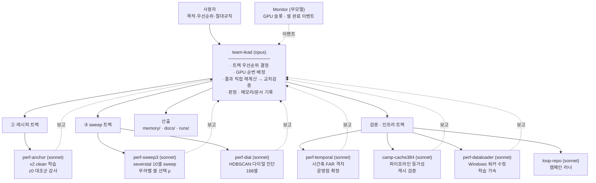

# 목적 · 배포 사다리 · 측정 규율 · 에이전트 설계 구조도

> **정본은 `docs/ABSOLUTE_RULES.md`.** 목적·사다리·데이터 경계·에이전트 프로토콜의 구속력 있는
> 기록은 그쪽이며, 충돌 시 그 파일이 우선한다. 이 문서의 고유 기여는
> **§4 측정 규율**(실측으로 도출한 판정 규칙)과 **§5 에이전트 설계 구조도**(실제 운용 결과)다.
> §1~3 은 실측 근거와 검증 상태를 붙인 요약이다.
>
> ⚠ **미해결 충돌**: `ABSOLUTE_RULES.md` §3 은 CCA 를 금지하는데, 이 문서와
> `HANDOFF_260726.md` 의 여러 결론(사다리 ① 실패 확정 = cca 14-source 행렬)이 cca 근거다.
> 또한 cca(7 class)는 무라벨 레시피 선택 규칙의 2차 검증 pool 로 계획돼 있었다.
> **기존 cca 근거를 소급 폐기할지, 신규 학습만 금지할지 사용자 판단 필요.**

관련: `CLAUDE.md` 절대규칙 0(요약), `docs/HANDOFF_260726.md` (실행 상태 스냅샷)

---

## 1. 목적 (사용자 directive, 260726 · 3회 반복 명시)

> 여러 데이터셋에서 contrastive 성능 향상을 확인하고 ablation 해서 최고 성능을 만들어낸다.
> **최종 목적은 사내 실제 데이터셋에서 unknown grouping 으로 신규불량 발생 시 감지해내는 것.**
> 이걸 위해 끊임없이, 몇 일이 걸려도 진행한다.

핵심은 **"신규불량 발생 **시**"** — 정적 clustering 품질이 아니라 **시간축 감지**가 최종 산출이다.
정적 지표(P1/noise/Comp/Hom/ARI)만 보면 FAR 5배 격차를 놓친다(260726 실측).

---

## 2. 배포 사다리 (사용자 명시 순서 — 변경 금지)

```
①  여기서 만든 모델로 바로 predict            (zero-shot, 학습 0)         가장 싸다
②  여기서 만든 레시피로 학습 후 predict        (B4 recipe 이식)
③  여기서 만든 recipe sweep 학습 후 predict    (사내에서 스윕)
④  CNN TAPT 까지 한 후 학습 sweep 후 predict   (가장 비싸다)
```

| 순위 | 검증 상태 (260726) | 근거 |
|---|---|---|
| **①** | ❌ **실패 확정** | cca 14 source 중 frozen 을 이기는 게 **0개**. champion 이 최악(P1 6/7→3~4/7, noise 59.7→95.8). severstal 에서도 seed_noise 77.9 ≈ frozen 76.7 = 임베딩 개선 0, 순수 후처리 |
| **②** | ✅ **작동** | severstal(산업 결함, 누수 0·튜닝노출 0) 다이얼 정정 후: P1 3/4 vs frozen 2/4, ARI 0.840 vs 0.522, Comp 0.859 vs 0.505. frozen 은 k=4~6 영역 30셀 **전부**에서 P1 ≤ 2/4 = 능력의 한계 |
| **③** | ⏳ **진행 중, 초기 성공** | severstal 10셀 스윕 승자 `lr008`(LR 0.004→0.008). base 대비 ARI **+62%**(0.390→0.630), seed_noise −12.2pp. 2셀 채점 미완 |
| **④** | 미착수 | same-domain 검증(260723)은 있으나 new-domain 에는 불리(260724) |

**함의**: 가장 싼 ①이 실패했으므로 **사내에서도 학습이 필요하다.** frozen 을 기준선으로 두고 ②부터 시작한다.

### 사다리를 가로지르는 전제조건 — 라벨 없이 고를 수 있는가

사내엔 라벨이 없다. **"성능이 올랐다"는 주장은 "라벨 없이 그 설정을 고를 수 있었나"까지 답해야 완결된다.**

| 무엇을 고르나 | 라벨 없이 | 상태 |
|---|---|---|
| **epoch** (한 run 안에서) | **Rule C** = `gate 통과 → k ≥ 자기 run 75th pct → argmin noise` | ✅ severstal 외부검증 통과 (오라클과 0.25pp) |
| **레시피** (run 들 사이) | `argmin(seed_noise)` | ⏳ 부분 성공 — **순위는 못 매기지만**(ρ +0.30/−0.29, 다이얼 따라 부호 뒤집힘) **승자는 두 다이얼 모두에서 적중**(lr008). 증거 약함, cca 재현 필요 |
| **다이얼** (HDBSCAN mcs/ms) | — | ❌ **방법 없음 (확정)** |

**다이얼이 라벨 없이 안 되는 이유** (severstal 168셀 실측):
- `Sil`: adapted 는 ρ 0.80~0.93 인데 **frozen 은 −0.18** → 어느 arm 인지 미리 모르므로 사용 불가
- `over_merge` 게이트: **frozen 의 k=2 병합 치팅을 못 잡는다** (20%-of-n 임계는 "거대 blob"만 잡음)
- frozen-leaf 는 **k 와 ARI 가 ρ −0.96** → noise 최소화가 곧장 병합 치팅으로 간다

**★ 그러나 k 를 입력으로 요구하는 것은 해법이 아니다.** k 는 모르는 게 전제이고
HDBSCAN 을 쓰는 이유가 k-free 라서다. 실제 해법 두 가지:
1. `min_cluster_size` 를 **원래 의미**로 쓴다 — "몇 장 이상 뭉쳐야 그룹인가"(운영 판단, k 무관)
2. **bootstrap 군집 안정성 최대**로 자동 선택 — 라벨도 k 도 안 쓴다

실측(260727): 안정성 기준이 severstal 의 아는 정답 **mcs20 을 정확히 집었다**.
DBCV 는 15 로 빗나갔고, **ARI 최대화는 mcs60(k=2 병합 치팅)** 으로 걸어갔다.
clean546 은 mcs 5~44 에서 ARI 0.63~0.70 으로 평탄 — 그 pool 은 다이얼이 애초에 안 중요했다.

---

## 3. 사내 배포 요구사항 (현재까지 확정)

1. **frozen 을 기준선으로, 사다리 ②부터 시작.** zero-shot 모델은 headroom 진단용 참조로만
2. **k 는 받지 않는다** — 모르는 게 전제다. 다이얼은 `min_cluster_size` =
   "몇 장 이상 뭉쳐야 그룹인가"(운영 판단)로 정하거나, bootstrap 안정성으로 자동 선택한다.
   ★ 260727 실측: 안정성 기준이 severstal 의 아는 정답(mcs20)을 집었다. ARI 최대화는 k=2 병합 치팅으로 감
3. **다이얼은 pool 마다 다시 정한다.** 다른 pool 값 이식 금지
4. **시간축 운영점 P10 / m_min = REF 크기 50th-pct / K=2** → FAR 0, 비용 lag +1~3배치.
   단 **그 pool 에서 FAR 을 다시 재라** — 배경 클래스가 많을수록 나빠진다(10종 1.25 → 21종 2.00/batch)
5. **검출 하한 누적 20~90장** (주입률 무관, 절대 장수)
6. 개선 주장에는 **z0(랜덤 head) 대조군을 용량 맞춰** 함께 측정

---

## 4. 측정 규율 (260726 하루에 같은 실수 4건 → 규칙화)

**공통 구조: 유리한(또는 물려받은) 측정 지점 하나에서 재고 결론을 냈다.**

| # | 결론이라 믿었던 것 | 실제 원인 | 흔들었더니 |
|---|---|---|---|
| 1 | P1 천장은 encoder 한계 | 낡은 HDBSCAN 다이얼 | 0/320 → 138+/320 이 7/7 |
| 2 | severstal 적응은 품질 희생 | mcs6 이 그 pool 에 과도하게 관대 | mcs20 에서 **전 지표 압승** |
| 3 | champion 이 FAR 우수 | P10 한 지점에서만 측정 | 재검증 통과 (양쪽 arm 이 독립적으로 P=10 에 수렴) |
| 4 | 적응이 grouping 개선 | 대조군이 frozen (틀린 기준선) | 랜덤 head 도 상당폭 개선 |

**확정 전 필수 체크**
1. 각 arm 을 **자기 최적점**에서 비교하고, **여러 다이얼에서 순위가 유지되는지** 확인
   (한 다이얼에서만 이기면 아티팩트다 — 260727 b4 비교가 그랬다)
2. 다이얼은 **bootstrap 군집 안정성 최대**로 다이얼을 고른다 (라벨·k 미사용, `site/_site_common.pick_dial_by_stability()`). 여러 다이얼에서 순위가 유지되는지도 확인한다 — 한 지점에서만 이기면 못 믿는다.
   ★ ARI 최대화 금지 — 병합할수록 오른다
3. 대조군 = **z0, 용량 매칭**
4. 퍼센타일 임계는 **캘리브레이션 창을 흔들어** 안정성 확인 (P1/P2 는 표본 55에서 관측 최솟값 = 불안정)
5. **reassign 전/후 분리 보고**
6. **loss 궤적 일치는 등가성의 증거가 아니다** (3자리 일치인데 ARI 0.18 갈림)

**잡음폭**: noise ±2.28pp / ARI ±0.019 / Hom ±0.005 / Comp ±0.033 / **P1 spread 0**
**민감도**: P1(∞) > ARI(3.87×) > Hom(3.22×) > noise(1.72×) > **Comp(0.87×, 가장 관대 — 단독 통과 금지)**
**우선순위**: **P1 > P2 noise > P3 Comp > P4 Hom** 사전식. frag 는 비용. 잡음폭 안은 동률 처리 후 다음 축

---

## 5. 에이전트 설계 구조도

### 5-1. 모델 배분 원칙 (사용자 지시)

> 중요한 마스터·판정·계획 에이전트는 고성능 모델, 파일검색·리드 같은 건 낮은 모델로 효율적으로.

```
opus    판정 · 계획 · 오케스트레이션 · 교차검증
sonnet  실행 트랙 (학습 dispatch, 채점, 재계산, 분석)
haiku   기계적 조회 (파일 검색, 로그 grep, 모니터링)
```

### 5-2. 구조



### 5-3. 자원 규율

- **GPU 1 프로세스만.** team-lead 가 순번을 배정하고, 에이전트는 앞 작업 종료를 폴링 후 진입
- CPU 바운드 작업(재클러스터링·채점·z0)은 GPU 순번과 무관하게 병렬 허용
- 학습 중 `REPRO_WORKERS` 금지 (Windows spawn 이슈, 수정됐으나 미검증)

### 5-4. 실제로 작동한 패턴 — **교차검증이 핵심이었다**

의도했던 "opus 3모델 판정 패널"은 opus 서브에이전트가 응답을 반환하지 않아 구성되지 않았다.
대신 수렴한 형태가 더 효과적이었다:

```
에이전트가 실행 → team-lead 가 원본 산출물을 직접 재계산 → 대조 → 불일치 지점을 되던짐
```

260726 하루에 잡힌 측정 오류 6건의 출처:
- **team-lead 재계산에서 3건** — 다이얼 부적합, 용량 불일치, reassign 지점
- **담당의 자기 철회 2건** — P1 임계 불안정(perf-temporal), 배포 기본값(perf-anchor)
- **에이전트가 team-lead 를 정정 1건** — exit code 오염 주장(camp-cache384)

**교훈: 에이전트에게 "불편한 결과를 완화하지 마라"를 명시적으로 지시하면 실제로 자기 결과를 철회한다.**
그리고 **오케스트레이터도 재계산 대상**이다 — team-lead 의 가설 3건이 데이터로 반박됐다.

### 5-5. 에이전트 지시서에 항상 포함할 것

1. **판정 규칙을 사전에 못 박는다** (사후 합리화 방지). "폭 밖이면 밖이라고 보고해라. 통과가 목표가 아니다"
2. **잡음폭과 민감도 순위**를 함께 준다 — 없으면 잡음을 신호로 읽는다
3. **음성 결과도 1급 산출물**임을 명시
4. **결과 폴더 삭제·수정 금지**, 산출은 새 파일
5. **`git commit <path>` 로 경로 명시** — 여러 에이전트가 워킹트리를 공유한다
6. 정책 변경은 **team-lead 가 한다.** 에이전트는 근거만 낸다
