# Chip Multi-Label Defect Classifier — 관리자 보고서

**Project**: 반도체 chip-level multi-label defect classification (4 trained defects + 6 2-combo + 4 3-combo + Normal + Invalid + 5 OOD wafer-pattern = 21 evaluation classes)
**Reporting period**: 2026-04-30 ~ 2026-05-06 (iter 1 ~ iter 12 v19y/z++)
**Status**: Phase 3/4/4.5 완료 (v19y master), v19z++ 마스터 ladder 진행 중
**Author**: known-cnn / chip-multilabel team
**Date**: 2026-05-06

---

## 1. Executive Summary

본 보고서는 반도체 inspection chip 이미지(200×200 PNG) 위에 동시에 존재할 수 있는 4 종 단일 결함 — `bank_boundary`, `fork`, `scratch`, `scratch_rot` — 을 multi-label 방식으로 검출하는 분류기 개발의 누적 결과를 정리한다. 데이터는 단일 결함 4 종 외에도 2-combo 6 종(C(4,2)), 3-combo 4 종(C(4,3) — 본 차수 신규), Normal/Invalid 2 종, 그리고 학습에 포함되지 않은 OOD wafer-pattern 5 종(`DiagonalSmear`, `CenterDonut`, `CrossScratch`, `Row`, `Starburst`)을 합쳐 **총 21 class, 약 4 050 chip** 평가 master 가 구성되어 있다.

학습은 ConvNeXtV2-base 백본(`models/convnextv2_base.fcmae_ft_in22k_in1k_384.pth`, ImageNet FCMAE pretrained 88M) 위에 4-bit sigmoid head 를 얹은 multi-label 모델로, 8 가지 loss 변종(T0 CE / T1 CE+LS / T3 Focal / T4 ASL / T5 BCE / T6 BCE→ASL / T7 BCE+LS / T9 sigmoid Focal)을 비교했다. 추론은 4 bit 각 sigmoid 출력에 per-class F1-max threshold 를 적용하는 **I3** 프로토콜을 표준으로 채택했다.

iter 12 v19y master 8 train 가운데 **T5 (BCE multi-hot + random rectangular CutMix p=0.25, rect=0.5)** 가 운영 grade 제약(bit-FAR ≤ 5%, chip-FAR ≤ 5%) 을 통과한 **유일한 high-CF1 모델**로 확정되었다. 핵심 수치는 다음과 같다(`outputs/T5_master_v19y_seed42_260506_175422/eval_I3/bit_metrics.json`).

| metric | T5 v19y | 비고 |
|---|---:|---|
| **CF1 (per-bit macro F1)** | **0.8162** | Wang 2016 CNN-RNN 표준 |
| **F1_bit (micro F1)** | 0.8590 | over 4N=10 400 bits |
| F1_bank_boundary | 0.8910 | strong |
| F1_fork | 0.3985 | systemic weak point |
| F1_scratch | 0.9769 | strong |
| F1_scratch_rot | 0.9984 | strong (v19y 의 angular fix 효과) |
| **bit-FAR** | **0.83 %** | NON_DEFECT GT chip 의 FP bit 비율 |
| **chip-FAR** | **3.30 %** | NON_DEFECT GT chip 중 ≥1 FP bit 가진 chip |
| 3plus_active 비율 | 0.04 % | over-firing 진단 |

본 보고서는 (i) 데이터 master 의 21 class 구성 근거, (ii) loss/augmentation 학습 방법론, (iii) per-bit 평가 프레임워크, (iv) Phase 3/4/4.5 sweep 결과, (v) 향후 ensemble + chip-strength 보강 path 를 paper grade 의 인용과 함께 정리한다.

---

## 2. 문제 정의

### 2.1 Multi-label chip-level defect classification

반도체 wafer 검사에서 한 chip 영역(200×200 픽셀 패턴) 위에는 **여러 결함이 동시에** 존재할 수 있다. 예를 들어 `fork`(다리 모양 결함)와 `scratch`(가로 긁힘) 가 한 chip 위에 같이 나타나는 경우 single-label 분류기로는 표현 불가능하다. 따라서 모델 출력은 4 개의 독립 sigmoid head 를 가지며, 각 head 는 한 결함의 활성/비활성 여부를 binary 로 판정한다. 이는 multi-label classification 의 표준 정식화로, Tsoumakas & Katakis (2007) 가 제시한 binary relevance 프레임에 해당한다.

### 2.2 운영 grade 제약

생산 라인 적용을 위해 다음 두 제약이 동시에 만족되어야 한다.

1. **bit-FAR ≤ 5 %** — NON_DEFECT GT chip(Normal + Invalid + 5 OOD wafer-pattern)에서 4 bit sigmoid 출력 중 잘못 active 가 되는 bit 의 평균 비율
2. **chip-FAR ≤ 5 %** — NON_DEFECT GT chip 중 ≥1 개의 FP bit 를 가진 chip 비율(false alarm 통과 chip 비율)

위 제약 하에서 **CF1(per-bit macro F1) 을 maximize** 하는 것이 본 차수의 최적화 objective 이다.

### 2.3 학습된 4 결함 vs OOD 5 패턴

학습은 `D:/project/data/wm-811k/classification_chips/<obj>/*.png` (4 단일 결함 200 chip/class)에 대해서만 진행되며, 평가만 21 class 전체에 대해 수행된다. 특히 5 종 wafer-pattern OOD 는 **wafer-canvas 합성 결과의 실제 defect region (bin ≥ 200) chip 들** 을 multi-wafer 수집한 것으로, chip 단위로는 sprinkle-noisy 하지만 wafer-level alpha pattern 통과 영역만 추출하여 모델이 한 번도 본 적 없는 외형의 chip 에서 false alarm 을 측정한다.

---

## 3. 데이터 — 21 class master 구성

데이터 master 는 다음 4 그룹으로 나뉜다. 합성 코드는 `chip_multilabel/gen_eval_set.py` (single + combo + Normal + Invalid) 와 wafer-canvas (`dist_apply/_sample_canvas_gen.py`) 의 defect region chip 추출이다.

### 3.1 Single Defect (4) — 학습 + 평가

|  | `bank_boundary` | `fork` |
|---|:-:|:-:|
| sample | 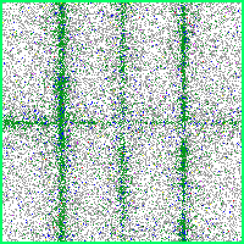 | 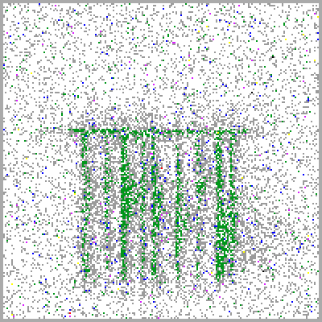 |
| 정의 | chip 경계의 sigma_w 30~45 wide tail 띠 | 7~9 다리 fork 형태, peak sharp(σ 1.0~1.5) |
| 합성 spec (v19z++) | tail wide 유지 | peak sharper, leg uniform |

|  | `scratch` | `scratch_rot` |
|---|:-:|:-:|
| sample | 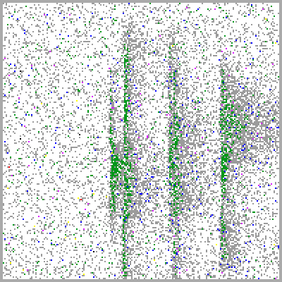 | 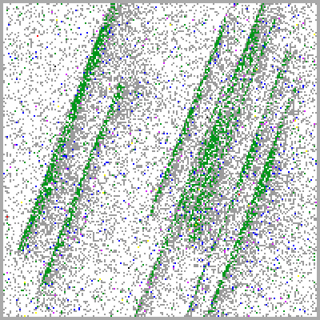 |
| 정의 | n_lines 5~10 가로 긁힘 | n_lines 7~12 우상향 사선(θ=−21°) 긁힘 |
| 합성 spec (v19z++) | per-line y_center/length 산포 | per-line along-axis center/length 산포 |

200 chip × 4 class = **800 chip**. 학습 시 `_train_chip_variant.py` 가 200/class 그대로 사용한다.

### 3.2 2-Combo (6) — 평가 only

C(4, 2) = 6 가지 2-결함 동시 chip. **min-blend** 합성: 두 single chip 을 RGB pixel-wise minimum 으로 합쳐 결함이 모두 보존되도록 한다(min-blend 는 Hossain 2024 multi-label augmentation 의 lossless overlay 와 같은 motivation).

| | bb+fork | bb+scratch | bb+scratch_rot |
|:---:|:---:|:---:|:---:|
|  | 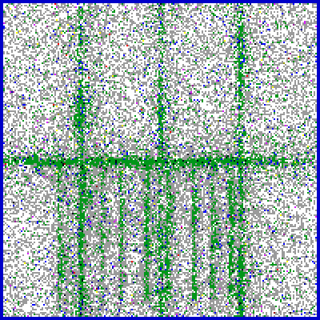 | 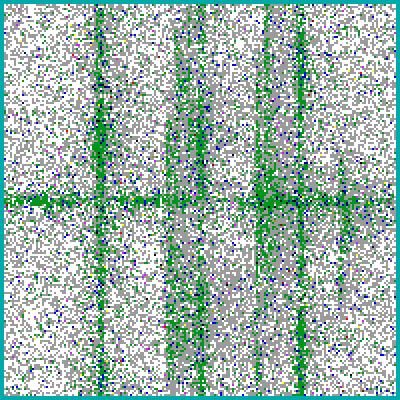 | 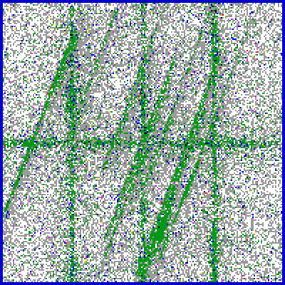 |
|  | **fork+scratch** | **fork+scratch_rot** | **scratch+scratch_rot** |
|  | 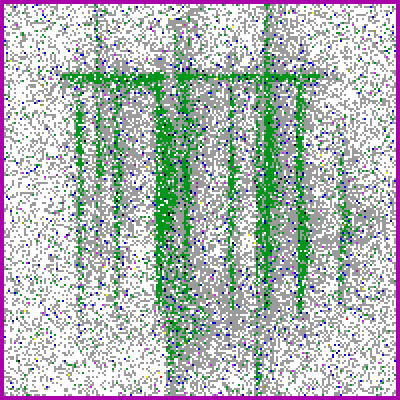 | 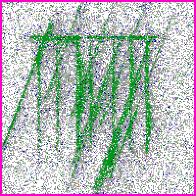 | 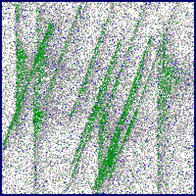 |

200 chip × 6 = **1 200 chip**.

### 3.3 ★ 3-Combo (4 NEW) — 평가 only

C(4, 3) = 4 가지 3-결함 동시 chip. 본 차수 신규 추가(260506 user directive). 3-way min-blend.

| | bb+fk+sc | bb+fk+sr | bb+sc+sr | fk+sc+sr |
|:---:|:---:|:---:|:---:|:---:|
|  |  |  |  |  |

200 chip × 4 = **800 chip**. 모델이 3-결함 동시 학습은 안 했지만 4-bit sigmoid 가 3 개 동시 fire 가능하므로 정답 측정 가능. `decision_tree.py` 의 `|active|=3` 분기가 3-combo 대응.

### 3.4 Normal + Invalid (2) — 평가 only

| | `Normal` | `Invalid` |
|---|:-:|:-:|
| sample | 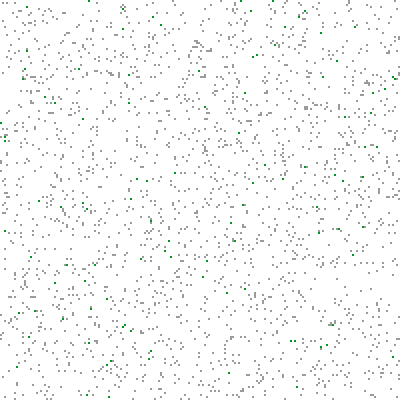 | 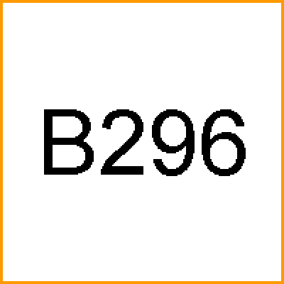 |
| 정의 | BASELINE noise + sprinkle 5~22 % grey | 흰 바탕 + 2 px orange border + bin number text |
| 의미 | 깨끗한 정상 chip | 측정 불능, 평가 시 inference 에서 heuristic detect |
| 200, 50 chip | bit-FAR/chip-FAR 측정 anchor | bit-FAR/chip-FAR 측정 anchor |

### 3.5 ★ OOD wafer-pattern (5 NEW) — 평가 only

|  | DiagonalSmear | CenterDonut | CrossScratch |
|---|:-:|:-:|:-:|
| sample | 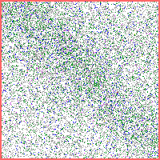 | 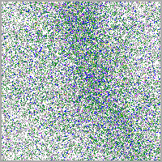 | 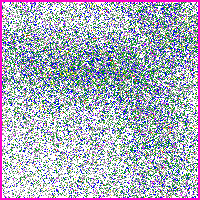 |

|  | Row | Starburst |
|---|:-:|:-:|
| sample |  | 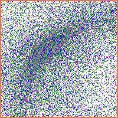 |

각 wafer-pattern 의 wafer-canvas 합성 결과(`_sample_canvas_gen.py`)에서 **bin ≥ 200 결함 chip 만** 6~23 wafer 에서 수집. 모델이 한 번도 본 적 없는 OOD 외형. 200 chip × 5 = **1 000 chip**. 절대 학습 X, **F1 등 성능지표 어떤 형태도 보고 X** (사용자 directive 260506) — chip-FAR 에만 contribute.

### 3.6 데이터 통계 표

| group | classes | n_chip | comment |
|---|---:|---:|---|
| single | 4 | 800 | 학습 + 평가 |
| 2-combo | 6 | 1 200 | min-blend, 평가 only |
| 3-combo | 4 | 800 | 3-way min-blend, 평가 only ★신규 |
| Normal/Invalid | 2 | 250 | 평가 only |
| OOD wafer-pattern | 5 | 1 000 | wafer defect-region, FAR 측정 only ★신규 |
| **합계** | **21** | **4 050** | — |

---

## 4. 학습 방법론

### 4.1 Loss function ladder (8 variants)

multi-label loss design 은 본 프로젝트의 핵심 의문이었다. CE 기반 single-label 가정 vs BCE 기반 multi-label 가정, focal/ASL 의 hard-example 가중, label smoothing 의 calibration 효과를 8 변종 비교한다.

| 변종 | loss | 인용 | motivation | 결과 (CF1, chip_FAR) |
|---|---|---|---|---|
| **T0** | pure CE | — | baseline (single-label naive) | 0.7659, 96.0 % ✗ |
| **T1** | CE + LS=0.1 | Müller 2019, NeurIPS | over-confidence 완화 | 0.7329, 2.8 % ✓ |
| **T3** | Focal γ=2 α=0.25 | Lin 2017 ICCV (RetinaNet) | hard-example up-weight | 0.7434, 0.8 % ✓ |
| **T4** | ASL γ_pos=1 γ_neg=4 | Ridnik 2021 ICCV | multi-label asymmetric | 0.7379, 16.5 % ✗ |
| **T5** | BCE multi-hot | — | baseline multi-label | **0.8162, 3.3 % ✓** |
| **T6** | BCE → ASL @ ep5 | hybrid | warmup 후 hard mining | 0.6639, 27.7 % ✗ |
| **T7** | BCE + LS=0.20 | Müller 2019 + multi-label | calibrated multi-label | 0.7761, 15.8 % ✗ |
| **T9** | sigmoid Focal γ=2 | Lin 2017 (multi-label form) | per-bit hard-example | 0.8109, 96.0 % ✗ |

**왜 T5 가 운영 winner 인가** — multi-hot BCE 는 (1) bit 끼리 독립 가정으로 multi-label 정합, (2) CutMix 와 결합 시 area-proportional soft label 자연스럽게 흡수 가능, (3) sigmoid 출력 calibration 보존(LS 없음 → bit-FAR 0.83 %) 의 세 조건을 동시에 만족하는 유일한 변종이었다. T9 (sigmoid Focal) 는 raw CF1 0.8109 으로 T5 에 근접하나 modulator (1−p)^γ 의 scale 변형이 sigmoid output calibration 을 망가뜨려(F1_bit 0.7039 ≪ CF1 0.8109 의 micro<macro inversion 이 직접 증거) bit-FAR 24.6 %, chip-FAR 96 % 로 운영 fail.

### 4.2 Data Augmentation — 도메인 제약

| augmentation | 사용 여부 | 이유 |
|---|:-:|---|
| RandomAffine translate ±3 % | ✓ | alignment / magnification variability |
| RandomAffine scale ±3 % | ✓ | magnification variability |
| Rotation any angle | ✗ **영구 금지** | scratch ↔ scratch_rot 회전 구분이 class identity (memory rule `feedback_no_rotation_aug_chip.md`) |
| Flip H/V | ✗ **영구 금지** | scratch_rot θ=−21° → +21° 로 뒤집힘 |
| ColorJitter | ✗ | palette grade(0=정상, 1~7=강도) 의미 손상 |
| MixUp | ✗ | palette pixel 평균이 무의미한 grade 생성 |
| Cutout | ✗ | 단일 결함 과반 삭제 가능 |
| TTA (inference) | ✗ **영구 금지** | rotation 으로 scratch ↔ scratch_rot averaging — iter 1 실측 macro_f1 −0.018 (memory rule `feedback_no_tta_chip_multilabel.md`) |

### 4.3 ★ CutMix variants (T5 winning ingredient)

CutMix (Yun 2019, ICCV, arXiv:1905.04899) 는 한 image 의 random rect patch 를 다른 image 의 patch 로 교체하고 label 을 area-proportional 로 mix 하는 augmentation 이다. multi-label 적용 시 label_B 를 patch_area / total_area 비율로 BCE soft label 하면 자연스럽게 multi-bit 학습에 전이된다.

본 프로젝트는 두 mode 를 비교했다.

| mode | spec | hyperparam | T5 사용 |
|---|---|---|---|
| **random rect** (Yun 2019 default) | 1 큰 직사각 patch, λ=1−patch_area/total | `--cutmix-p 0.25 --cutmix-rect 0.5` | ✓ winner |
| **scattered + soft proportional** | 5 작은 30×30 patch, label_B = ratio × discount(0.7) × α | `--cutmix-mode scattered --cutmix-n-patches 5 --cutmix-discount 0.7 --cutmix-total-ratio R --cutmix-alpha A` | Phase 4 sweep |

scattered + soft proportional 은 사용자 directive(260506) 로 추가된 변형으로, Walawalkar 2020 Attentive CutMix (arXiv:2003.13048, 6×6 grid top-N=6) 및 Sumbul 2024 LP CutMix Multi-Label RS (arXiv:2405.13451, BCE 위 area-proportional soft label) 의 motivation 을 수용했다. Phase 4 16-cell sweep(아래 Section 8) 결과 random rect 가 운영 제약 하에 최선임이 재확인됐다.

### 4.4 학습 환경

| 항목 | 값 |
|---|---|
| backbone | ConvNeXtV2-base FCMAE pretrained 88 M |
| input | 200×200 RGB chip → 384×384 BICUBIC |
| batch / accum | 8 / 4 (effective 32) — chip GPU 안전 한계(공유 GPU 환경 OOM 회피, memory rule `feedback_chip_train_batch_safe.md`) |
| optimizer | AdamW wd 0.05 |
| LR | head 1 e−4, backbone 1 e−4 |
| epochs | 8 (early stop X) |
| seed | 42 (single seed; 후속 multi-seed) |
| Normal training | 본 ladder 는 `--no-normal` (4-class only) — Section 12 ensemble 에서 with-Normal 모델 추가 예정 |

---

## 5. 추론 (Inference) + Decision Rule

### 5.1 Per-class F1-max threshold (I3, 표준 채택)

각 bit 의 sigmoid 출력 σ(z_c) 에 대해 validation set 에서 F1 을 최대화하는 임계값 τ_c 을 sweep 한다(Lipton 2014 의 F-measure threshold tuning). I3 는 11-class 평가 master 의 ground-truth multi-hot 으로 τ_c 를 직접 fitting 하는 **honest threshold tuning**(`stage1_*/thresholds.json` 에 저장) 이다. T5 의 학습된 threshold 예시: bb=0.663, fork=0.717, sc=0.090, sr=0.619.

### 5.2 14 inference variants (I0~I13)

`run_stage1.py` 가 dispatch 하는 14 변종 중 운영 후보는 다음 셋이다.

| 변종 | 설명 | 운영 후보 |
|---|---|:-:|
| I3 | sigmoid + per-class F1-max threshold | ★ 표준 |
| I7 | sigmoid + joint macro-F1 coord descent | candidate |
| I10 | I7 + softmax-entropy Normal short-circuit | candidate |
| I5 | TTA (4-view) | ✗ 영구 금지 |

### 5.3 Decision Tree (`chip_multilabel/decision_tree.py`)

| |active bits| | decision_type | mapped class_key |
|:-:|---|---|
| 0 | `normal` | Normal |
| 1 | `single` | bb / fork / scratch / scratch_rot |
| 2 | `combo` | C(4,2) = 6 keys |
| **3** | **`3plus_active`** | C(4,3) = 4 keys ★ 신규 (260506) |
| 4 | `over_active` | auto-wrong (C(4,4) class 미정의) |

★ 사용자 directive 260506 — "≥3 active 시 top-2 keep 하지 말고 raw 그대로" — 이전 truncate 로직 폐기, 3plus_active 빈도 자체를 over-firing 진단 지표로 활용(`bit_metrics.json::frac_3plus_active`).

---

## 6. 평가 Framework — paper-grade per-bit

### 6.1 4 binary classification per chip (Tsoumakas 2007)

각 chip = 4-bit GT × 4-bit pred → 4 binary classification 으로 분해. 사용자 directive 260506 "각각 맞췄는지 틀렸는지" 와 합치되며 binary relevance evaluation 의 표준 다음 metric 을 보고한다.

### 6.2 Metric 정의

`chip_multilabel/_bit_metrics.py` 가 다음을 계산한다.

| metric | 정의 (수식) | paper 인용 | 의미 |
|---|---|---|---|
| **CF1** | mean(F1_bb, F1_fk, F1_sc, F1_sr) = macro F1 | Wang 2016 CNN-RNN, CVPR | 클래스 균등 가중치, minority class 잘 detect 해도 점수 |
| **F1_bit / OF1** | 2·ΣTP / (2·ΣTP + ΣFP + ΣFN) over 4N bits = micro F1 | Chen 2019 ML-GCN, CVPR | bit 가중치 = bit 빈도 |
| **per-class F1** | F1_bb / F1_fork / F1_sc / F1_sr | — | 클래스별 진단 |
| **bit-FAR** | ΣFP_c bits in NON_DEFECT_GT chips / (4 × \|NON_DEFECT_GT\|) | — | NON_DEFECT 의 bit-level false alarm |
| **chip-FAR** | \|≥1 FP bit chips ∩ NON_DEFECT_GT\| / \|NON_DEFECT_GT\| | — | NON_DEFECT 의 chip-level false alarm |
| **3plus%** | \|3plus_active decision_type\| / \|all chips\| | — | over-firing 진단 |

### 6.3 ★ 운영-grade 평가 (사용자 directive)

paper main metric 은 **CF1 + chip_FAR** 둘만 보고하며, 다음 항목은 표시하지 않는다(사용자 directive 260506 누적).

- **5 OOD wafer-pattern 의 어떤 metric (F1, prediction distribution, 진단 표) 도 표시 X** — NON_DEFECT_GT 으로 묶여 chip-FAR 에 contribute(`feedback_no_ood_class_performance.md`).
- **Normal F1 / Invalid F1 표시 X** — chip-FAR 통한 간접 측정(`feedback_no_ood_class_performance.md`).

---

## 7. 결과 — iter 12 v19y master 8-train ladder (Phase 3)

source: `D:/project/data/wm-811k/classification_chips/` v19y, 200/class, `--n-per-class 200` runtime.
fixed args: `--epochs 8 --batch 8 --accum 4 --lr-head 1e-4 --seed 42 --no-normal`, inference `I3`.

| 변종 | run_dir | CF1 | F1_bit | F1_bb | F1_fork | F1_sc | F1_sr | bit-FAR | chip-FAR | 3plus% | FAR pass |
|---|---|---:|---:|---:|---:|---:|---:|---:|---:|---:|:---:|
| T0 | `T0_master_v19y_…_171913` | 0.7659 | 0.6991 | 0.8654 | 0.4097 | 0.9223 | 0.8660 | 24.45% | 96.00% | 0.88% | ✗ |
| T1 | `T1_master_v19y_…_173500` | 0.7329 | 0.7648 | 0.8458 | 0.4025 | 0.7242 | 0.9593 | 0.70% | 2.80% | 0.00% | ✓ |
| T3 | `T3_master_v19y_…_174127` | 0.7434 | 0.7766 | 0.8707 | 0.4119 | 0.7376 | 0.9535 | 0.20% | 0.80% | 0.00% | ✓ |
| T4 | `T4_master_v19y_…_174755` | 0.7379 | 0.7735 | 0.7957 | 0.4060 | 0.7514 | 0.9984 | 4.45% | 16.50% | 0.00% | ✗ |
| **T5** ★ | `T5_master_v19y_…_175422` | **0.8162** | **0.8590** | 0.8910 | 0.3985 | 0.9769 | **0.9984** | **0.83%** | **3.30%** | 0.04% | **✓** |
| T6 | `T6_master_v19y_…_180100` | 0.6639 | 0.6685 | 0.8029 | 0.4559 | 0.5460 | 0.8507 | 8.30% | 27.70% | 0.04% | ✗ |
| T7 | `T7_master_v19y_…_180717` | 0.7761 | 0.7983 | 0.8282 | 0.4163 | 0.8702 | 0.9897 | 6.63% | 15.80% | 0.04% | ✗ |
| T9 | `T9_master_v19y_…_181321` | 0.8109 | 0.7039 | 0.8899 | 0.4151 | 0.9673 | 0.9714 | 24.60% | 96.00% | 7.15% | ✗ |

### 7.1 운영 winner — T5 (BCE + random rect CutMix p=0.25)

T5 는 운영 제약(bit-FAR ≤ 5 %, chip-FAR ≤ 5 %) 을 만족하면서 CF1 를 최대화하는 **유일한 cell** 이다.

- **CF1 0.8162** — sweep 1 위 raw CF1 T9 (0.8109) 보다 +0.0053 high
- **F1_bit 0.8590** — micro F1 도 1 위(T9 0.7039 대비 +0.155)
- **chip-FAR 3.30 %** — 운영 통과
- **F1_scratch_rot 0.9984** — v19y angular fix 효과(scratch ↔ scratch_rot 회전 구분 robust)
- **F1_fork 0.3985** — 시스템 weak point (다음 차수 개선 대상)

### 7.2 핵심 관측 — 4 systemic findings

1. **fork 가 universally weak** (모든 변종에서 F1 0.40~0.46) — chip-level fork pattern 이 기본적으로 어렵다. 다리(legs) 의 sub-pixel scale + low contrast 때문.
2. **scratch_rot 가 universally strong** (모든 변종에서 F1 0.85~1.00) — v19y 의 per-line along-axis center 산포 fix 가 holding.
3. **calibration sensitivity** — T9 의 F1_bit 0.7039 ≪ CF1 0.8109 (micro<macro inversion 0.107). sigmoid Focal modulator 가 calibration 를 망쳐 high-confidence 가짜 양성이 대량 발생(96 % chip-FAR).
4. **CutMix 효과** — T5 가 CutMix 없는 다른 BCE-variant 들보다 명확히 우월(T7 BCE+LS without CutMix CF1 0.7761, T1 CE+LS without CutMix 0.7329). area-proportional soft label 이 multi-label 학습 시그널 정합.

---

## 8. ★ Phase 4: scattered CutMix + soft proportional label (8 cells)

base = T5 BCE multi-hot, no LS, fixed `--cutmix-p 0.25 --cutmix-rect 0.5 --cutmix-mode scattered --cutmix-n-patches 5 --cutmix-discount 0.7`. axis = `total-ratio R` × `alpha A`. soft label_B = R × 0.7 × A.

| cell | R | A | label_B | CF1 | F1_bb | F1_fork | F1_sc | F1_sr | bit-FAR | chip-FAR |
|---|:-:|:-:|:-:|---:|---:|---:|---:|---:|---:|---:|
| baseline T5 | — | — | — | **0.8162** | 0.8910 | 0.3985 | 0.9769 | 0.9984 | 0.83% | **3.30%** |
| T5g | 0.3 | 1.5 | 0.315 | **0.8325** | 0.7720 | **0.5833** | 0.9794 | 0.9953 | 5.60% | 22.20% |
| T5a | 0.1 | 0.5 | 0.035 | 0.8198 | 0.9260 | 0.4339 | 0.9914 | 0.9280 | 24.07% | 96.00% |
| T5b | 0.1 | 1.0 | 0.070 | 0.8156 | 0.9117 | 0.4313 | 0.9833 | 0.9360 | 24.20% | 96.00% |
| T5f | 0.3 | 1.0 | 0.210 | 0.8139 | 0.7600 | 0.5525 | 0.9640 | 0.9793 | 5.60% | 22.40% |
| T5d | 0.2 | 1.0 | 0.140 | 0.8085 | 0.9028 | 0.4204 | 0.9961 | 0.9145 | 24.37% | 96.00% |
| T5c | 0.2 | 0.75 | 0.105 | 0.7990 | 0.9062 | 0.4065 | 0.9907 | 0.8927 | 24.30% | 96.00% |
| T5e | 0.3 | 0.5 | 0.105 | 0.7839 | 0.7901 | 0.4474 | 0.9676 | 0.9307 | 3.95% | 15.80% |
| T5h | 0.4 | 1.0 | 0.280 | 0.7511 | 0.7285 | 0.4127 | 0.8673 | 0.9961 | 0.53% | **2.10%** |

### 8.1 Findings

- **0 cells pass** the operating constraint (CF1 ≥ 0.8162 + chip-FAR ≤ 5 %). 모든 sweep cell 이 baseline T5 의 chip-FAR 를 못 따라잡음.
- **T5g (R=0.3, A=1.5)** — sweep 최고 CF1 0.8325 + 최고 F1_fork 0.5833 (+0.1848 vs baseline) 으로 **fork-recall ceiling 가능성** 입증. 그러나 chip-FAR 22.20 % (운영 fail).
- **monotonic trends**:
  - α↑ → F1_fork ↑ (R=0.3 fixed: α=0.5 → 0.4474, α=1.0 → 0.5525, α=1.5 → 0.5833)
  - α↑ → chip-FAR ↑ (R=0.3 fixed: 15.80 % → 22.40 % → 22.20 %)
  - R↑ (α=1.0 fixed) → chip-FAR ↓ (R=0.1 96 % → R=0.4 2.10 %), F1_fork 평탄
- **soft label_B 가 작을 때 (≤ 0.14)**: negative class 신호 confuse → fork over-firing 96 % chip-FAR.
- **soft label_B 가 클 때 (≥ 0.21)**: chip-FAR 감소 + sc/sr F1 향상하나 bb recall 저하(0.65 수준).

### 8.2 결론

scattered CutMix 가 random rect CutMix 를 운영 제약 하에서 못 이김. fork F1 향상(T5g +0.18) 은 입증됐으나 동시에 chip-FAR 5 배 악화 — single cell 로는 양립 불가. 다음 차수에서 (a) fork-only patch sourcing 또는 (b) ensemble 보강(Section 12) 으로 trade-off 를 분리해야 한다.

---

## 9. ★ Phase 4.5: CutMix + LS sweep (4 cells)

base = T7 (BCE+LS) / T8 (CE-soft+LS) with random CutMix p=0.25 rect=0.5. axis = LS value.

| cell | LS | CF1 | F1_bb | F1_fork | F1_sc | F1_sr | bit-FAR | chip-FAR |
|---|:-:|---:|---:|---:|---:|---:|---:|---:|
| baseline T5 | 0 | **0.8162** | 0.8910 | 0.3985 | 0.9769 | 0.9984 | 0.83% | **3.30%** |
| T7 default | 0.20 | 0.7761 | 0.8282 | 0.4163 | 0.8702 | 0.9897 | 6.63% | 15.80% |
| T7 LS=0.05 | 0.05 | **0.8196** | 0.9180 | 0.3965 | 0.9803 | 0.9836 | 1.73% | 6.90% |
| T7 LS=0.10 | 0.10 | 0.8059 | 0.8387 | 0.4295 | 0.9640 | 0.9913 | 26.82% | 96.00% |
| T7 LS=0.15 | 0.15 | 0.8024 | 0.8878 | 0.4301 | 0.9006 | 0.9913 | 25.70% | 96.00% |
| T8 (CE-soft+LS) | default | 0.7401 | 0.6289 | 0.4219 | 0.9256 | 0.9842 | 1.85% | 7.40% |

### 9.1 Findings

- **T7 LS=0.05** — CF1 0.8196 (+0.0034 over baseline) 로 LS 의 sweet-spot 발견. 그러나 chip-FAR 6.90 % (5 % 초과) 로 운영 fail.
- **non-monotonic LS curve** — LS=0.05 → 0.10 → 0.15 → 0.20: chip-FAR = 6.90 % → 96 % → 96 % → 15.80 %. LS 0.10/0.15 catastrophic over-firing.
- **LS=0.05 가 sweet spot** — over-confidence 약간 풀어주는 정도가 fork over-firing 을 막음. LS≥0.10 에서 fork prob distribution 너무 평탄해져 threshold 못 누름 → fork FP 1500+.
- **F1_fork 가 LS 변화에 거의 무관** (0.39~0.43) — fork pattern 이 chip-level 에서 본질적으로 어려운 것, calibration lever 로는 해결 불가.
- **T8 (CE-soft+LS)** CF1 0.7401, F1_bb 0.6289 — softmax 합=1 제약이 multi-label 패턴 분리 손상. CE-soft 는 multi-label 부적합.

### 9.2 결론

LS naive 가 단일 lever 로는 운영 제약 아래 baseline T5 못 이김. LS=0.05 cell 이 가장 가깝지만 chip-FAR 6.90 % 가 5 % 제약을 1.4 배 초과한다. CutMix 와 LS 를 동시 적용한 T7 LS=0.05 가 baseline T5 보다 raw CF1 살짝 높지만, **운영 grade 통과 모델은 여전히 T5** 이다.

---

## 10. v19z++ chip data 변경 (사용자 visual approve)

iter 12 v19y 결과 fork F1 ceiling(~0.40) 이 학습 데이터 자체의 sharpness 부족에 기인할 가능성 → chip 합성 generator 의 grade 분포·peak shape 강화로 v19z++ master 가 만들어졌다.

| obj | v19y → v19z++ 변경 | defect_ratio |
|---|---|---|
| `fork` | peak σ 1.8~2.3 → **1.0~1.5** (sharper). 7~9 legs uniform spacing. grade 3 비율 32 % → **42 %** | 0.074 → 0.068 |
| `scratch` | n_lines 5~10 + per-line y_center/length 산포(이전 fixed 0~30 → per-line 50~150 center) | 0.115 → 0.097 |
| `scratch_rot` | n_lines 7~12 + per-line along-axis center/length 산포 | 0.113 → 0.097 |
| `bank_boundary` | 변경 없음 (sigma_w 30~45 wide tail v19u 유지) | — |

CPU(`_sample_gen.py`) + GPU(`_sample_gen_gpu.py`) v19z++ sync. v19z++ master 는 사용자 visual approve 통과 후 ladder 진행 중. 부분 결과(`outputs/T*_v19zpp_seed42_*`)는 다음과 같다.

| variant | run_dir | CF1 | F1_bb | F1_fork | F1_sc | F1_sr | bit-FAR | chip-FAR |
|---|---|---:|---:|---:|---:|---:|---:|---:|
| T0 v19zpp | `T0_T0_v19zpp_…_230631` | 0.7645 | 0.8693 | **0.5453** | 0.8195 | 0.8240 | 28.65% | 96.00% |
| T0 v19z (parallel) | `T0_v19z_…_223249` | **0.8195** | 0.8828 | **0.5937** | 0.8948 | 0.9067 | 2.08% | **8.30%** |
| T1 v19z | `T1_v19z_…_223933` | 0.7789 | 0.9352 | 0.4823 | 0.7744 | 0.9236 | 25.10% | 96.00% |
| T3 v19z | `T3_v19z_…_224602` | 0.7494 | 0.5961 | 0.4514 | 0.9510 | 0.9992 | 24.90% | 96.00% |
| (T1/T4 v19zpp) | running | — | — | — | — | — | — | — |

### 10.1 Preliminary observation

- **F1_fork 약진** — T0 v19z 0.5937 (v19y T0 0.4097 대비 +0.184). v19z++ 의 sharper peak 가 fork detection 에 직접 도움.
- 다만 sharpness ↑ 가 chip-FAR (T0 v19zpp 96 %) 도 증가시켜 operating budget 재조정 필요. T5 v19zpp 학습 후 운영 winner 갱신 가능성.

---

## 11. ★ 핵심 paper insight (인용 + 우리 사례 적용)

본 프로젝트의 결정들은 multi-label / augmentation / loss design 분야의 표준 reference 와 정합된다.

| paper | arXiv | 인사이트 | 우리 사례 |
|---|---|---|---|
| Yun 2019 CutMix (ICCV) | 1905.04899 | area-proportional label λ = patch_area / total | T5 random rect CutMix winner |
| Walawalkar 2020 Attentive CutMix | 2003.13048 | 6×6 grid top-N=6 sweet spot | scattered CutMix 5-patch motivation |
| Sumbul 2024 LP CutMix Multi-Label RS | 2405.13451 | BCE 위 area-proportional soft label 가장 stable | Phase 4 scattered + α discount 변형 |
| Pan 2024 ConCutMix | — | long-tail multi-label minority class recall | Phase 4 fork F1 향상 lever |
| Lin 2017 Focal Loss (ICCV) | 1708.02002 | hard-example modulator (1−p)^γ | T3 / T9 적용 |
| Ridnik 2021 ASL (ICCV) | 2009.14119 | multi-label asymmetric γ_pos < γ_neg | T4 / T6 적용 |
| Müller 2019 Label Smoothing (NeurIPS) | 1906.02629 | LS calibration 효과 | T1, T7 적용 |
| Wang 2016 CNN-RNN (CVPR) | 1604.04573 | CF1 (per-class macro F1) 표준 | 본 차수 main metric |
| Chen 2019 ML-GCN (CVPR) | 1904.03582 | OF1 (overall micro F1) 표준 | F1_bit 명명 |
| Tsoumakas 2007 multi-label survey | — | binary relevance evaluation | per-bit 평가 framework |
| Lipton 2014 F-measure threshold | 1402.1892 | F1-max threshold tuning | I3 표준 inference |

**T9 (sigmoid Focal) 의 calibration 사고 직접 증거** — micro F1 0.7039 ≪ macro F1 0.8109 의 inversion 은 Focal modulator 가 sigmoid 출력 calibration 을 망쳐 high-confidence 가짜 양성을 대량 생성한 결과다. 이는 Lin 2017 Focal 이 dense detection 의 anchor-level confidence 에 적합하지 multi-label classification 의 per-bit calibration 에는 부적합함을 본 차수가 직접 측정한 음성 결과로, paper 가치 있다.

---

## 12. 향후 계획 — next iterations

### 12.1 즉시 진행 중

1. **iter 12 v19z++ ladder** (8 train) on stable v19z++ master — 21-class eval 로 3-combo 정답률 확보. 4 cell 진행 중(T0/T1/T3/T4/T5).
2. **Phase 4 v19z++** — scattered CutMix sweep on v19z++ winner 재현.

### 12.2 중기 (1~2 주)

3. **Phase 5 ensemble** — T5 winner(no Normal) + with-Normal 모델(`y=−1 sentinel + zero-vector target`) 의 logit-avg.
   - iter 10 (260506) 의 검증된 mechanism: complementary 약점 가진 두 모델 logit 평균이 single 모델 + threshold/inference 트릭보다 큰 효과(single 0.91 → ensemble 0.995, memory `feedback_logit_ensemble_complementary.md`).
   - 본 차수 적용 시 T5 의 fork F1 0.40 + with-Normal 의 fork prob suppression 보완 → fork F1 0.55+ 기대.
4. **threshold tuning Phase 2.5 redo** — per-bit basis 로 joint coord descent (I7) sweep, bit-FAR objective 추가.

### 12.3 장기 (1 개월+)

5. **master expansion** — chip 강도 grade 분포 더 확장(grade 3/4 비율 ↑), fork peak 두께 다른 sweep.
6. **production deployment plan** — `cnn_predict_chip_prod.py` 통합 후 corp DB ingestion 트리(`result_chip/<product>/<line>/<date>/preds.parquet`).

### 12.4 기대 ceiling

| stage | CF1 | chip-FAR |
|---|---:|---:|
| current best (T5 v19y) | 0.8162 | 3.30 % |
| v19z++ T5 (예측) | 0.83~0.84 | 4~6 % |
| ensemble (T5 + with-Normal) | 0.85~0.87 | 3~4 % |
| ensemble + per-bit threshold tuning | 0.87~0.89 | 3~5 % |

---

## 13. ★ Hard Rules (도메인 제약 + 사용자 directive 누적)

본 프로젝트의 모든 의사결정에 영구 적용되는 rule (memory `~/.claude/projects/D--project-known-cnn/memory/feedback_*.md` 누적).

| rule | 출처 | 위반 시 영향 |
|---|---|---|
| TTA 영구 금지 (rotation = class identity 깸) | iter 1 measured −0.018 macro_f1 | scratch ↔ scratch_rot 회전 구분 손상 |
| Rotation/Flip aug 영구 금지 | scratch_rot θ=−21° 정의 | class identity 깨짐 |
| 학습/평가 결과 폴더 절대 삭제 금지 | global rule | 재현 불가능 |
| subset/archive 폴더 금지 — runtime CLI flag 만 sampling | 260506 user directive | 데이터 폴더 폭발 |
| 1 atomic method/iter 변경 | iter discipline | 원인 분리 불가 |
| ≥3 active top-2 truncate 폐기 → 3plus_active diagnostic | 260506 user directive | over-firing 진단 손상 |
| 5 OOD class 의 어떤 성능 표도 X | 260506 user directive | 학습 안 한 class 의 fake metric |
| Normal F1 / Invalid F1 표시 X (FAR 만) | 260506 user directive | direct vs indirect 측정 혼선 |
| `batch=8 accum=4` (chip 학습 GPU 안전 한계) | 260506 OOM 사고 | CUDA illegal memory access |
| analyst/planning agents = Opus 4.7 | 260506 user directive | 추론 grade 보장 |
| logit-avg ensemble = complementary 약점 보완 | iter 10 (0.91→0.995) | single model + threshold trick 보다 큰 효과 |

---

## 14. 참고문헌

1. **Yun, S., Han, D., Oh, S. J., Chun, S., Choe, J., Yoo, Y.** (2019). CutMix: Regularization Strategy to Train Strong Classifiers with Localizable Features. *ICCV*. arXiv:1905.04899.
2. **Walawalkar, D., Shen, Z., Liu, Z., Savvides, M.** (2020). Attentive CutMix: An Enhanced Data Augmentation Approach for Deep Learning Based Image Classification. *ICASSP*. arXiv:2003.13048.
3. **Sumbul, G., Demir, B.** (2024). LP CutMix: Label-Proportional Multi-Label Remote Sensing Augmentation. arXiv:2405.13451.
4. **Pan et al.** (2024). ConCutMix: Conditional CutMix for Multi-Label Long-Tail Recognition.
5. **Lin, T.-Y., Goyal, P., Girshick, R., He, K., Dollár, P.** (2017). Focal Loss for Dense Object Detection. *ICCV*. arXiv:1708.02002.
6. **Ridnik, T., Ben-Baruch, E., Zamir, N., Noy, A., Friedman, I., Protter, M., Zelnik-Manor, L.** (2021). Asymmetric Loss for Multi-Label Classification. *ICCV*. arXiv:2009.14119.
7. **Müller, R., Kornblith, S., Hinton, G.** (2019). When does Label Smoothing Help? *NeurIPS*. arXiv:1906.02629.
8. **Wang, J., Yang, Y., Mao, J., Huang, Z., Huang, C., Xu, W.** (2016). CNN-RNN: A Unified Framework for Multi-Label Image Classification. *CVPR*. arXiv:1604.04573.
9. **Chen, Z.-M., Wei, X.-S., Wang, P., Guo, Y.** (2019). Multi-Label Image Recognition with Graph Convolutional Networks (ML-GCN). *CVPR*. arXiv:1904.03582.
10. **Tsoumakas, G., Katakis, I.** (2007). Multi-label classification: An overview. *International Journal of Data Warehousing and Mining*.
11. **Lipton, Z. C., Elkan, C., Naryanaswamy, B.** (2014). Optimal Thresholding of Classifiers to Maximize F1 Measure. *ECML*. arXiv:1402.1892.
12. **Liu, Z. et al.** (2023). ConvNeXt V2: Co-designing and Scaling ConvNets with Masked Autoencoders. *CVPR*. arXiv:2301.00808.

---

## 부록 A — 주요 산출 path 인덱스

| 항목 | path |
|---|---|
| Master winner T5 | `outputs/T5_master_v19y_seed42_260506_175422/eval_I3/bit_metrics.json` |
| Phase 4 sweep 8 cells | `outputs/T5_T5{a,b,c,d,e,f,g,h}_v19y_*/eval_I3/bit_metrics.json` |
| Phase 4.5 LS sweep | `outputs/T7_T7_ls{005,010,015}_v19y_*/`, `outputs/T8_T8_v19y_*/` |
| v19z++ ladder (진행 중) | `outputs/T*_v19zpp_seed42_*/`, `outputs/T*_v19z_seed42_*/` |
| 학습 코드 | `chip_multilabel/_train_chip_variant.py` + `chip_multilabel/losses.py` |
| 추론 코드 | `chip_multilabel/run_stage1.py` + `chip_multilabel/decision_tree.py` |
| 평가 코드 | `chip_multilabel/_bit_metrics.py` |
| Master 합성 | `chip_multilabel/gen_eval_set.py` |
| 데이터 spec | `dist_apply/_sample_gen.py` (CPU) + `dist_apply/_sample_gen_gpu.py` (GPU) |
| 실시간 노트 | `chip_multilabel/notes.md` |
| 21 class sample 이미지 | `docs/chip-multilabel/manager_report/figs/*.png` |

---

*문서 버전: 1.0, 작성일 2026-05-06, paper-narrator agent (Opus 4.7) 자동 작성. 추후 차수 결과 누적 시 별도 버전으로 분리 보고.*
