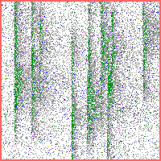
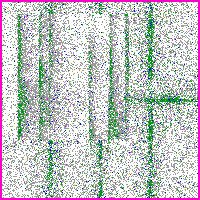
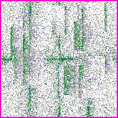

# Chip Multi-Label 결함 분류기

## 프로젝트

chip 이미지(200×200) 의 결함 4종(bank_boundary, fork, scratch, scratch_rot) 을 **multi-label** 로 분류 — 한 chip 에 여러 결함 동시 가능, sigmoid 4 head 독립 출력. 학습 = 단일 결함 4×200 + 정상 200 (1,000장), 평가 = 단일 + 2-combo + OOD-overlay + Normal/Invalid + OOD wafer 무늬 = 20 class 3,850장. chip 합성 = wafer 분포 → alpha map → 확률적 grade 픽셀 → 8-color palette PNG. combo 는 RGB pixel-wise min (두 결함 darker 보존).

## 평가 지표

각 chip은 4-bit GT 와 4-bit pred를 비교해서 **각 bit를 독립 binary classification으로 본다**. 즉 chip 한 장에서 4개의 binary 판정이 나온다. bit 순서는 정해져있다:

```
[ bit 0 = bank_boundary, bit 1 = fork, bit 2 = scratch, bit 3 = scratch_rot ]
```

예를 들어 fork + scratch가 같이 있는 chip의 GT는:

```
[ bb=0, fork=1, scratch=1, scratch_rot=0 ]   = [0, 1, 1, 0]
```

bit 1, bit 2 만 활성. 모델은 4개의 sigmoid 출력을 threshold 비교해서 같은 형식의 4-bit pred를 만든다.

- **CF1** (per-bit macro F1): 4 class 각각의 F1을 따로 구한 다음 평균. 모든 class에 동등 가중. 한 class가 약하면 평균이 떨어지므로 minority class 진단에 좋다. 논문 main metric.
- **F1_bit** (micro F1): 4 class 의 TP/FP/FN을 한꺼번에 모아서 F1 한 번 계산. bit 빈도에 비례 가중되므로 large class가 결과를 dominate.
- **chip_FAR**: 정상이어야 할 chip 중에서 모델이 결함 bit를 하나라도 잘못 fire 한 비율. 라인 운영에서 가장 중요한 false alarm 지표. 우린 이걸 정상/측정불능(Normal+Invalid) chip 만 보는 `ni_chip_FAR`(운영 main)와 학습 안한 OOD chip 만 보는 `ood_chip_FAR`(diagnostic) 둘로 분리해서 본다.

운영 통과 기준은 `CF1 ≥ 0.83` + `ni_chip_FAR ≤ 5%` 동시 만족.

## 현재 성능

| metric | 값 | 무엇을 보는가 |
|---|---:|---|
| **CF1** | **0.9406** | 4 class F1 의 산술평균 (모든 class 동등 가중) — 논문 main 지표 |
| F1_bit | 0.9375 | 4 bit 전체를 한꺼번에 합쳐 계산한 F1 (전반적 bit 정확도) |
| F1_bank_boundary | 0.9797 | bank_boundary bit 의 F1 (TP 와 FP, FN 균형) |
| F1_scratch | 0.9165 | scratch bit 의 F1 |
| F1_scratch_rot | 0.9979 | scratch_rot bit 의 F1 |
| **ni_chip_FAR** | **0.00%** | 정상/측정불능 chip 중에서 모델이 결함 bit 하나라도 잘못 fire 한 비율 — 운영 main |
| ood_chip_FAR | 1.41% | 학습 안한 OOD 무늬 chip 중 fire 한 비율 (진단용, 운영 통과 판정엔 X) |

운영 threshold (`CF1 ≥ 0.83` + `ni_chip_FAR ≤ 5%`) 통과 ✅.

## 데이터 — 4 group sample

### 학습 4 obj single defect (학습 + 평가)

| | | | |
|:---:|:---:|:---:|:---:|
|  |  |  |  |
| bank_boundary | fork | scratch | scratch_rot |

### 6 2-combo (평가 only, min-blend)

| | | |
|:---:|:---:|:---:|
|  |  |  |
| bb+fork | bb+scratch | bb+sr |
|  |  |  |
| fork+scratch | fork+sr | sc+sr |

### 4 OOD-overlay (평가 only — 2 trained + 1 OOD overlay, GT는 2 trained bit만)

bit 순서 = `[bb, fork, scratch, scratch_rot]`

| | |
|:---:|:---:|
|  |  |
| fork+sc + OOD_DiagonalSmear<br>GT = [bb=0, **fork=1**, **sc=1**, sr=0] | bb+fork + OOD_CenterDonut<br>GT = [**bb=1**, **fork=1**, sc=0, sr=0] |
|  |  |
| fork+sr + OOD_CrossScratch<br>GT = [bb=0, **fork=1**, sc=0, **sr=1**] | sc+sr + OOD_Starburst<br>GT = [bb=0, fork=0, **sc=1**, **sr=1**] |

### Normal / Invalid

| | |
|:---:|:---:|
|  |  |
| Normal | Invalid |

### 4 OOD wafer-pattern (평가 only — 학습 안한 외형, false alarm 측정)

| | | | |
|:---:|:---:|:---:|:---:|
|  |  |  |  |
| DiagonalSmear | CenterDonut | CrossScratch | Starburst |

OOD chip 은 wafer 단위 합성한 불량 wafer 에서 결함 영역(bin ≥ 200) 의 chip 만 따왔다. 등록된 4 결함(bb/fork/sc/sr) 형태가 아니라 학습에 한 번도 들어가지 않은 외형이다. **현업 라인에서 학습 안 한 새 결함 패턴이 random 하게 들어오는 상황을 시뮬레이션**하려고 평가에만 추가했다 — 모델이 이걸 보고 학습된 4 결함 중 하나로 잘못 fire 하면 false alarm 으로 잡힌다 (`ood_chip_FAR`).

## 학습 기법 설명

### CutMix — 학습 시 chip 두 장을 합쳐 새 학습 sample 생성

학습 데이터에는 단일 결함 chip 만 있다. 그대로 학습하면 모델이 chip 한 장에 결함이 두 개 동시에 있는 평가 case 를 못 본다. CutMix 는 학습 중 일부 batch (예: 25%) 에 대해 chip A 위에 chip B 의 일부를 paste 해서 multi-label sample 을 즉석에서 만든다. 학습 안한 combo 평가에 generalize 가능하게 됨.

**random rectangle CutMix** (Yun 2019) — chip A 위에 chip B 의 직사각 patch 한 개 paste. label 은 면적 비례 union.

| 원본 bank_boundary | 원본 scratch | CutMix 결과 |
|:---:|:---:|:---:|
|  |  |  |

**scattered CutMix** (Walawalkar 2020) — 큰 사각 한 개 대신 여러 patch (10개 50×50) 흩뿌림. fragmented 합성으로 결함이 chip 안 random 위치에 분산.

| 원본 bank_boundary | 원본 scratch | scattered CutMix (10 patches × 50×50) |
|:---:|:---:|:---:|
|  |  |  |

**grid CutMix** — chip 을 8×8 grid (각 25×25) 로 나누고 각 cell 별로 random 하게 chip A 또는 B 선택. 0/1 binary mask 로 섞음.

| 원본 bank_boundary | 원본 scratch | grid CutMix (8×8 binary mask) |
|:---:|:---:|:---:|
|  |  |  |

```
mask 8x8 (1=scratch, 0=bank):     ← 64 cell 각각 random binary
[0 1 1 0 0 1 0 1]
[0 0 1 1 1 1 1 1]
[1 0 1 0 1 0 0 1]
[1 1 0 1 1 0 0 0]
[0 1 1 0 1 1 0 1]
[0 1 1 0 0 1 0 1]
[1 1 1 0 0 0 0 0]
[1 0 1 1 1 1 0 1]
```

### Loss — 어떤 식으로 틀렸는지를 모델에 알려주는 함수

#### BCE (Binary Cross Entropy)

multi-label 표준. 4 class 각각 독립 binary classification 으로 보고 loss 계산.

```
chip → CNN → [ logit_bb, logit_fork, logit_sc, logit_sr ]
                 ↓ sigmoid (각 독립)
              [ p_bb,    p_fork,    p_sc,    p_sr   ] ∈ [0, 1]
                 ↓ 각 class 별 binary CE
            L = -Σ_c [ y_c · log(p_c) + (1 - y_c) · log(1 - p_c) ]
```

★ 핵심: 4 sigmoid head 가 **독립** — fork prob 0.9 + scratch prob 0.8 동시 가능. softmax 와 다름.

#### CE (Cross Entropy)

softmax 기반 single-class loss. 4 class 중 1 개만 살린다.

```
[logit_bb, logit_fork, logit_sc, logit_sr]
       ↓ softmax (합이 1 로 강제)
[p_bb=0.05, p_fork=0.85, p_sc=0.07, p_sr=0.03]   ← 한 class 가 dominant
```

→ 한 chip 에 fork+scratch 동시 있으면 둘 중 하나만 살리고 나머지 손해 → multi-label 부적합.

#### Label Smoothing (LS, Müller 2019)

target 을 0/1 hard 가 아닌 soft 로:

```
원본 target (fork 만 있음):
    [bb=0,    fork=1,    sc=0,    sr=0]

LS ε=0.20 적용:
    [bb=0.05, fork=0.85, sc=0.05, sr=0.05]
                ↑ 100% 확신 안 하게 됨
```

over-confidence 완화 → calibration 향상.

#### Focal Loss (Lin 2017)

쉬운 example (이미 잘 맞춘) 의 loss 를 줄이고 어려운 example 에 집중.

```
weight = (1 - p)^γ  (γ=2)

p=0.1 (어려움): BCE 2.30 × weight 0.81 = 1.86  ← 거의 그대로
p=0.5 (보통):   BCE 0.69 × weight 0.25 = 0.17  ← 줄어듦
p=0.9 (쉬움):   BCE 0.10 × weight 0.01 = 0.001 ← 거의 0
```

class imbalance 또는 hard example 학습 시 효과적. RetinaNet 의 multi-label 버전 (sigmoid focal) 도 있음.

#### ASL (Asymmetric Loss, Ridnik 2021)

multi-label 전용. positive (실제 결함) 와 negative (정상) 에 비대칭 weight:

```
y=1 (실제 결함):   focal γ_pos=1   ← BCE-like, 거의 그대로
y=0 (실제 정상):   focal γ_neg=4   ← 매우 강하게 down-weight
                                    + clip=0.05 (저신뢰 negative 무시)
```

의미: "정상 chip 에 결함 fire 한 case 가 너무 흔하면 model 무거운 penalty 줘서 fire 안 하게 만든다." multi-label SOTA loss.

### 기타

- **Normal training** — 정상 chip 을 zero-vector label `[0,0,0,0]` 으로 학습.
- **logit-avg ensemble** — 두 모델의 sigmoid 직전 logit 평균.
- **chip_FAR split** — false alarm 을 정상/측정불능 (`ni_chip_FAR`) vs 학습 안한 OOD (`ood_chip_FAR`) 로 분리.

## paper grounding

BCE / CF1 / F1_bit (Tsoumakas 2007, Wang 2016, Chen 2019), LS (Müller 2019), Focal (Lin 2017), ASL (Ridnik 2021), CutMix (Yun 2019, Walawalkar 2020, Sumbul 2024).
