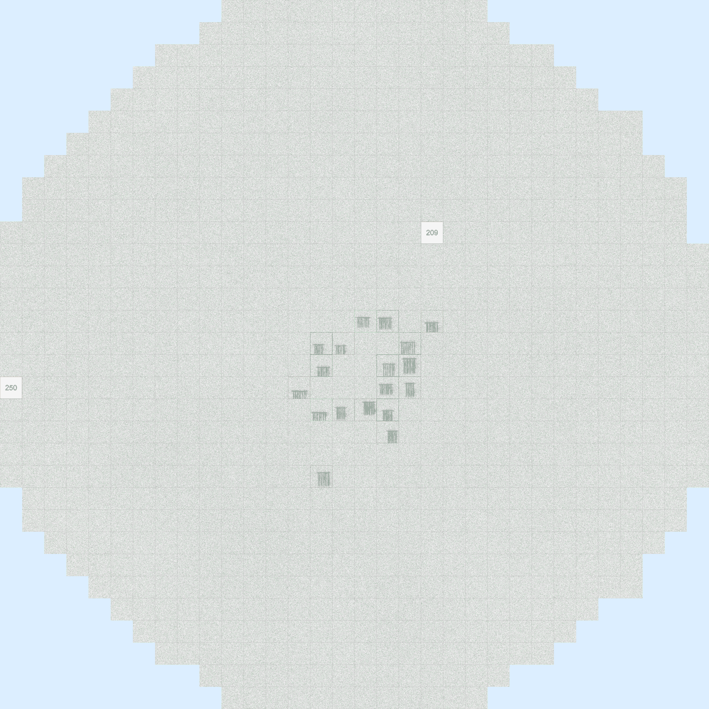
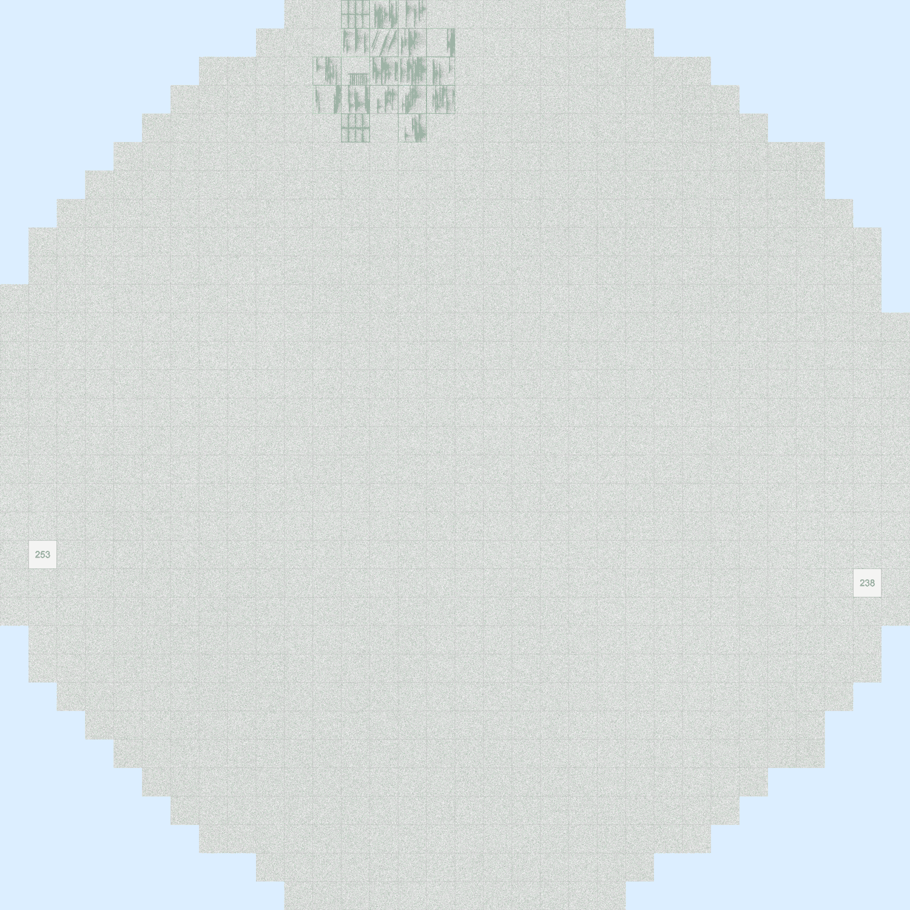
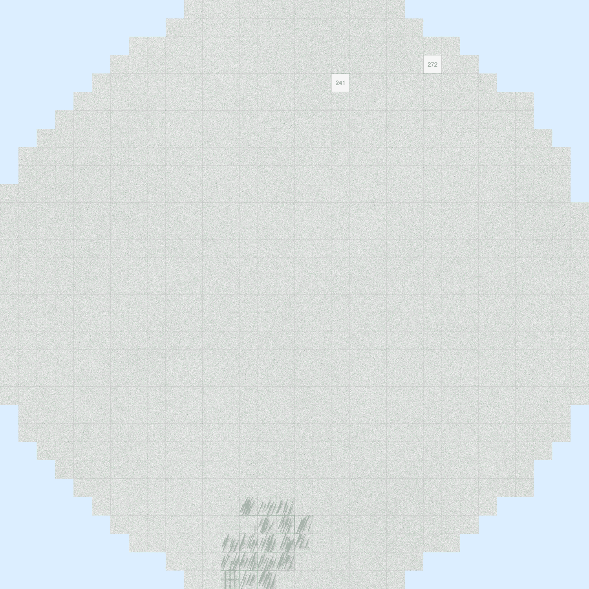
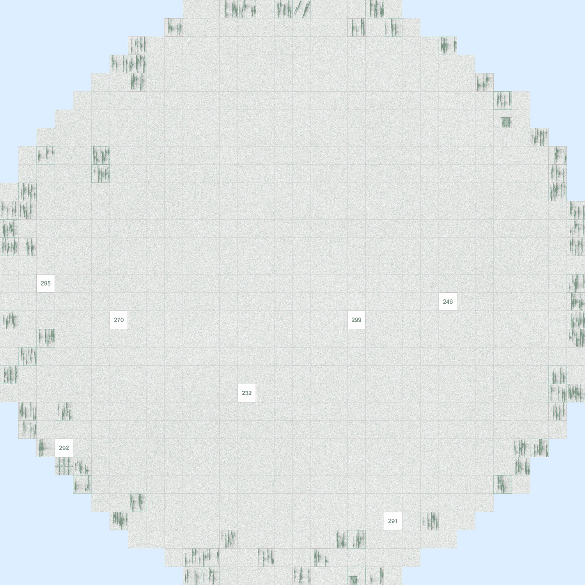
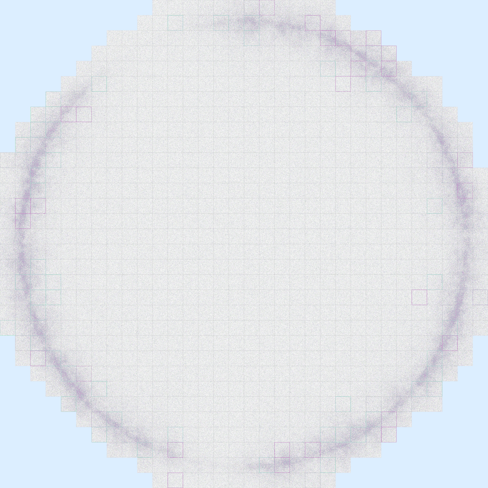
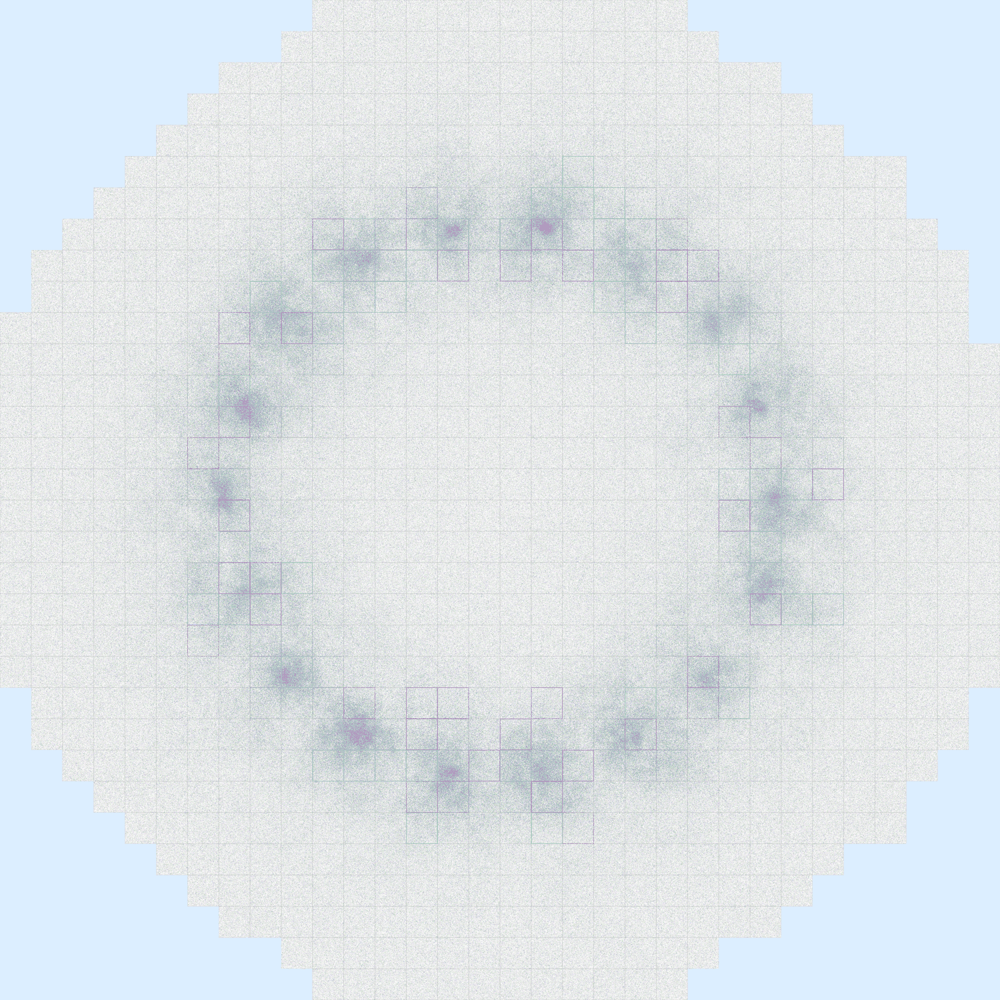
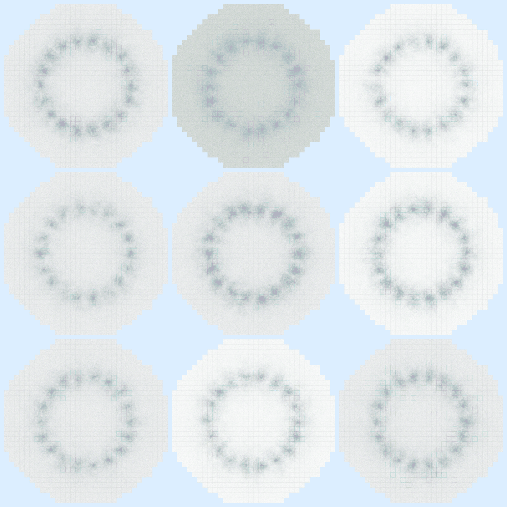
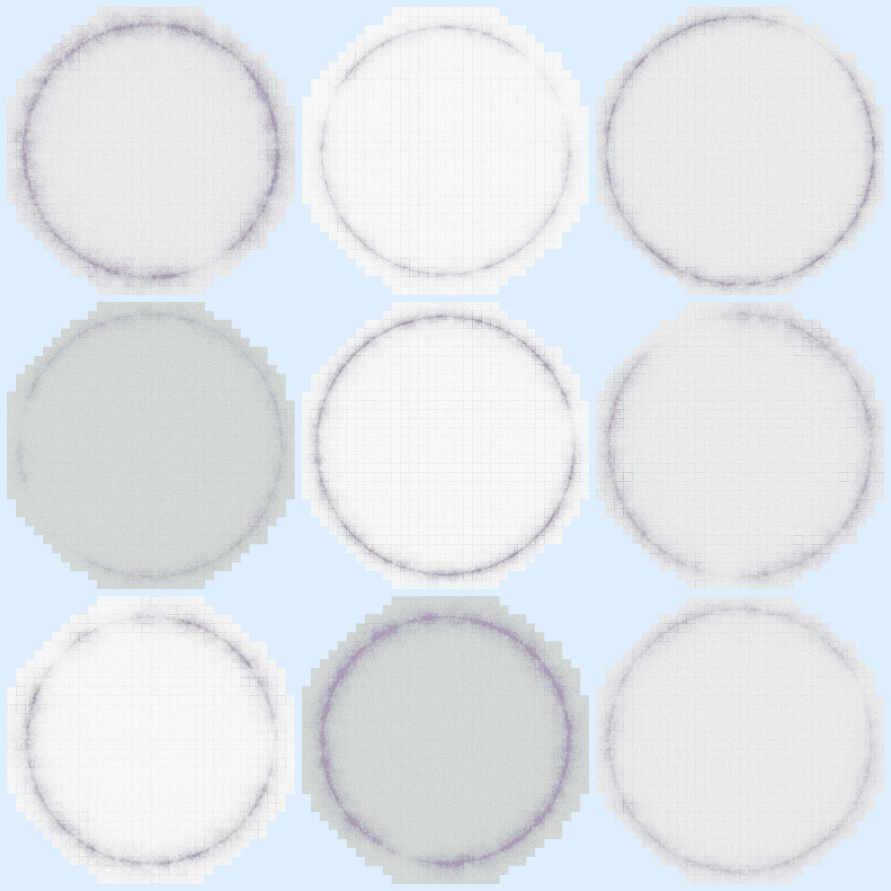
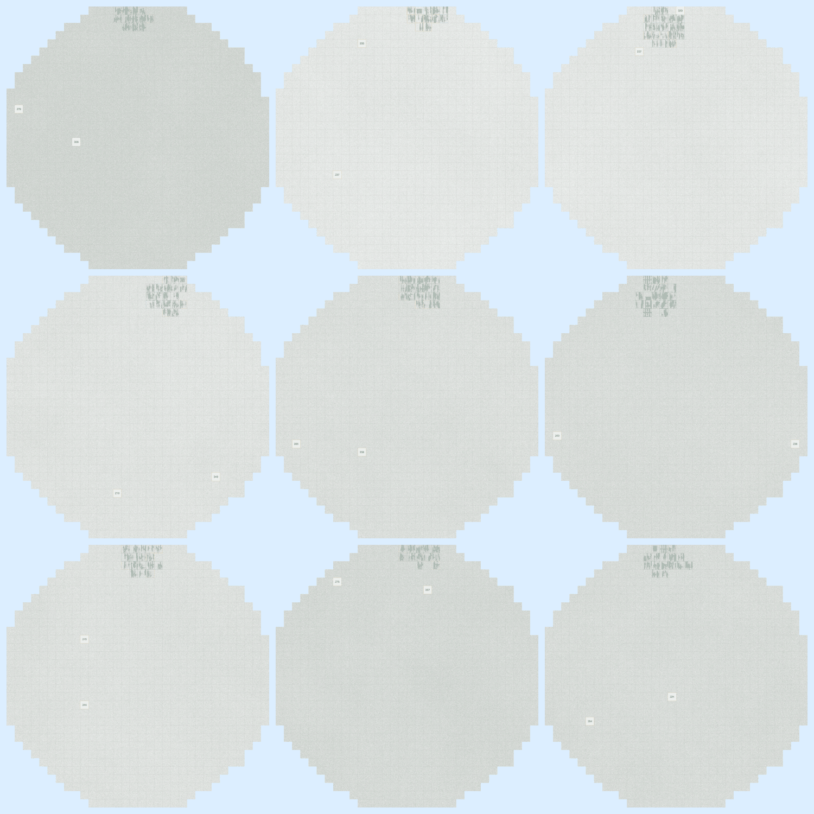
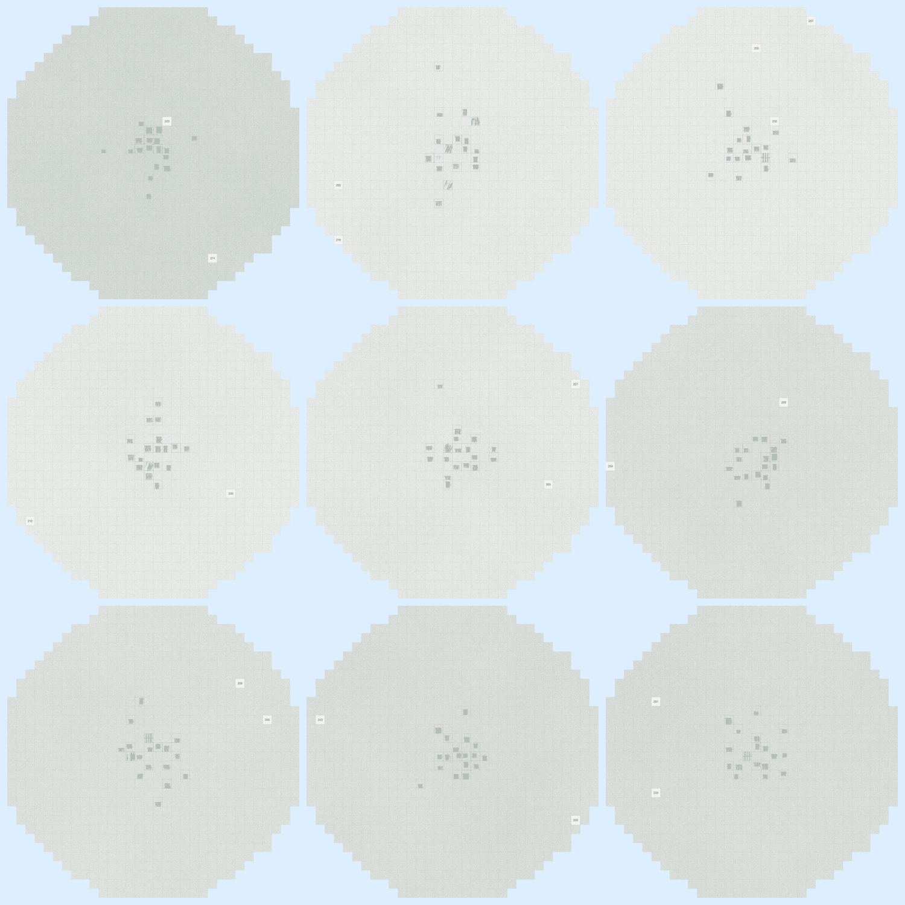

# Contrastive Wafer Defect Clustering

## 프로젝트

WM-811K wafer 결함 패턴을 **label 없이** group 으로 자동 묶는다.
- 학습 데이터 = 42 defect class 평균 30 + Normal 1000 = **2,146 wafer** (label 안 씀)
- 학습 후 embedding → HDBSCAN → group 자동 발견
- 평가는 학습 끝난 뒤 GT 라벨로 group 품질만 채점

## 기본 골격

```
wafer ──► CNN ──► proj head ──► 128-dim emb ──► HDBSCAN ──► group A, B, ..., N + noise
        (frozen)  ↑                                       (mcs=12, eps=0.06)
                  contrastive 학습 (InfoNCE, label X)
                  같은 wafer 두 view = positive
                  다른 wafer        = negative
```

self-supervised contrastive learning — 라벨 없이 augment 두 view 사이 유사도만 학습 → wafer embedding 공간에서 같은 결함은 가까이 / 다른 결함은 멀리 자동 정렬 → HDBSCAN 으로 group 발견.

---

## 주요 지표 + 주요 실험

### 운영 통과 4 기준 (lock-in)

| 우선순위 | 지표 | 기준 |
|---|---|---|
| **P1** | class_capture_rate | = 1.000 |
| **P2** | noise(def) | ≤ 6% (≤ 10% 허용) |
| **P3** | Completeness | ≥ 0.9 |
| **P4** | Homogeneity | ≥ 0.9 |

보조: AMI / ARI / Silhouette.

#### 각 기준 운영 의미 — 매니저 시각

| 우선순위 | 한 줄 설명 | 통과 시 운영 의미 | 위반 시 운영 의미 |
|---|---|---|---|
| **P1** capture = 1.000 | 결함 종류 누락 검사 | 모든 결함 종류가 group ≥1 에 들어감 → **어떤 결함이든 분류 가능** | 한 종류라도 group 못 잡으면 → 그 종류는 라인에서 한 번도 발견 안 됨 (recall 0%, 0.976 도 ❌) |
| **P2** noise ≤ 6% | wafer 한 장 한 장 분류율 | 결함 wafer 거의 다 group 에 들어감 → 자동 분류 통과, 라인 throughput 정상 | ≥10% 면 작업자가 noise wafer 수동 재검사 → throughput 4 배 손실 |
| **P3** Comp ≥ 0.9 | 같은 결함끼리 한 group | 같은 class wafer 30 장이 한 group 에 모임 → **한 번 라벨링 = 30 장 모두 처리** | 같은 결함이 5 group 으로 흩어짐 → 라벨러 작업량 5 배 폭증 |
| **P4** Hom ≥ 0.9 | group 안 결함 섞임 검사 | group 안 ≥90% 가 같은 결함 → **라벨 한 번 = 거의 모두 맞음** | group 안 다른 결함 섞이면 → 라벨 후 wafer 일일이 재검사 (라벨 신뢰도 ↓) |

**핵심 차이**: P1 은 "종류 누락" 만, P2 는 "wafer 한 장 한 장" — P2 가 더 빡빡. P3 은 "흩어짐 (split)", P4 는 "섞임 (mix)" — Comp/Hom 은 trade-off 관계라 AMI 가 두 개 동시 봄.

### 주요 실험 (전체 30 iter 중 의미 있는 8개)

| # | atomic 변경 | Comp | AMI | noise(def) | capture | ARI | 판정 |
|---|---|---:|---:|---:|---:|---:|---|
| **A0** | baseline | 0.938 | 0.895 | 9.34% | 1.000 | 0.704 | base |
| **1 ★** | LW 0.5→1.0 | 0.948 | 0.904 | **4.62%** | 1.000 | 0.733 | **P2 King** |
| 6 | EPOCHS 5→10 | 0.798 | 0.806 | 9.34% | 1.000 | 0.557 | reject (over-fit) |
| 9 | PercPos α=0.85 | 0.813 | 0.826 | 5.15% | 1.000 | 0.601 | reject (PercPos dead) |
| **11** | LR 1e-3→5e-4 | 0.948 | 0.905 | 6.11% | 1.000 | 0.734 | accept |
| **13** | + NEG 0.72→0.65 | 0.949 | 0.906 | 5.32% | 1.000 | 0.743 | accept |
| **14 ★★** | + TEMP 0.07→0.05 | **0.952** | **0.913** | 6.63% | 1.000 | **0.763** | **Quality King** |
| 17 | WARMUP 1→2 | 0.944 | 0.890 | 7.94% | **0.976 ❌** | 0.698 | reject (P1 violation) |

기타 22 iter 는 LW 사촌 / TEMP 사촌 / LR 사촌 / TOPK / QUEUE / BATCH / multi-axis combo — 모두 reject 또는 == Iter 1/14. 자세한 묶음은 `docs/paper/ITERATIONS.md`.

진짜 lever 4 axis: **LW**, **LR_HEAD**, **NEG_SIM**, **NCE_TEMP**. 나머지 axis 모두 dead.

---

## 1. 학습 데이터 — 결함 43 종 중 6 종 미리 보기

전체 anchor = **결함 43 종 × 평균 30 wafer + 정상 1,000 wafer = 2,146 wafer**.
아래 6 장은 그중 일부 sample — 4 종 site×chip 결함 + 2 종 canvas pattern. 학습 단계엔 라벨 안 씀, wafer 1 장당 augment 두 view 로 self-paired contrastive.

<table>
<tr>
<td align="center" valign="top" width="33%"><br><b>Center_fork</b><br>site×chip object</td>
<td align="center" valign="top" width="33%"><br><b>Edge-Top_scratch</b><br>site×chip object</td>
<td align="center" valign="top" width="33%"><br><b>Edge-Bottom_scratch_rot</b><br>site×chip object</td>
</tr>
<tr>
<td align="center" valign="top" width="33%"><br><b>Edge-Ring_scratch</b><br>site×chip object</td>
<td align="center" valign="top" width="33%"><br><b>BrokenRing</b><br>canvas pattern</td>
<td align="center" valign="top" width="33%"><br><b>RingDots</b><br>canvas pattern</td>
</tr>
</table>

위 6 wafer 의 종류: 4 site×chip (Center_fork / Edge-Top_scratch / Edge-Bottom_scratch_rot / Edge-Ring_scratch) + 2 canvas (BrokenRing / RingDots). 나머지 37 종류 (Donut_*, Full_*, Thick-Edge_*, CrescentArc, CrossScratch, DiagonalSmear, ParallelScratches, RingDots variants, ... + 정상 wafer Normal_bank_boundary 1000 장) 도 같은 anchor 안에 모두 포함되어 학습 / 평가됨.

### 합성 방식 (sister repo `known-cnn/dist_apply/_sample_gen.py`)

```
1) wafer canvas 선택  (8 distribution: Center / Donut / Edge-Ring / Edge-Bottom /
                                       Edge-Top / Full / Thick-Edge / Normal)

2) chip-object 합성  (5 object: bank_boundary / fork / scratch / scratch_rot / invalid_main)

3) chip 안 grade 픽셀 확률적 채움 (8-color palette PNG)
```

## 2. grouping 결과 — 여러 wafer → 한 group

같은 class 의 wafer 들이 시각적으로 다양해도 (밝/어두움, defect 영역 넓/좁) 모델이 한 group 으로 묶음. 각 panel = **같은 class 의 wafer 중 9 FPS distinct sample** (3×3 grid). 5 group (3 site×chip + 2 canvas):

<table>
<tr>
<td align="center" valign="top" width="50%"><br><b>RingDots group</b><br>canvas pattern</td>
<td align="center" valign="top" width="50%"><br><b>BrokenRing group</b><br>canvas pattern</td>
</tr>
<tr>
<td align="center" valign="top" width="50%"><br><b>Edge-Top_scratch group</b><br>site=Edge-Top + chip=scratch</td>
<td align="center" valign="top" width="50%"><br><b>Center_fork group</b><br>site=Center + chip=fork</td>
</tr>
</table>

3 site×chip (Center fork / Edge-Top scratch / Edge-Ring scratch) — 같은 chip 결함 (scratch) 라도 wafer 위치 (site) 다르면 다른 group + 같은 site (Center) 라도 chip 결함 다르면 다른 group.
2 canvas (BrokenRing / RingDots) — chip object 없는 wafer 외형 패턴도 별도 group 으로 인식.

→ 같은 group 안 9 wafer 가 **밝기 / 결함 영역 / dot 분포 다양** 해도 묶임 (FPS pair-dist 0.19~0.66). 모델이 **site × chip-object × wafer-canvas** 3 축 모두 인식.

---

## GROUP 어떻게 만드나

```
[1] 학습 단계 (label 안 씀)
─────────────────────────────────
wafer 1 장
   │
   ├──► augment view 1 (random crop, rotate, flip)
   │       │
   │       └──► CNN backbone (ConvNeXtV2-base, frozen)
   │              │
   │              └──► projection head (학습 대상, 128-dim)
   │                     │
   │                     └──► z₁ (128-dim)
   │
   └──► augment view 2 (다른 random)
           └──► (위와 같은 CNN+head)
                 └──► z₂ (128-dim)

학습 목표:
  · 같은 wafer 의 z₁ ↔ z₂ → cosine sim ↑ (positive pair)
  · 다른 wafer 의 z   → cosine sim ↓ (negative, queue 4096 + batch 8)

Loss = InfoNCE = -log[ exp(sim(z₁,z₂)/τ) / Σ exp(sim(z₁,z_neg)/τ) ]


[2] embedding 추출 (학습 끝난 후)
─────────────────────────────────
2,146 wafer × 1 image (augment 안 함)
   │
   └──► CNN+head → 2,146 × 128-dim embedding matrix


[3] HDBSCAN 으로 group 자동 발견
─────────────────────────────────
embedding 2,146 점
   │
   └──► HDBSCAN(min_cluster_size=12, min_samples=4,
                cluster_selection_method='leaf',
                cluster_selection_epsilon=0.06,
                metric='euclidean')
          │
          ├──► group #0 (size N₀ ≥ 12)
          ├──► group #1 (size N₁ ≥ 12)
          ├──► ...
          ├──► group #43 (size N₄₃ ≥ 12)
          └──► noise (= group 못 들어간 wafer)
```

**핵심**: 학습 단계에 GT label 안 씀. HDBSCAN 도 label 안 씀. group 개수 ('n_clusters') 도 모델이 자동으로 정함 (mcs=12 가 유일한 size 제약). 평가만 GT 사용.

---

## 학습 기법

### 1. InfoNCE — 자기-자기 끌어당기고 남-남 밀어내기

label 없이 모델 학습 시키는 핵심 loss.

```
positive: 같은 wafer 두 augment view (z_a, z_b)
negative: 다른 wafer 4104 개 (queue 4096 + batch 8)

L = -log [ exp(sim(z_a, z_b) / τ) / Σ_neg exp(sim(z_a, z_neg) / τ) ]
                                  ↑ τ = 0.05 ~ 0.07 (sharp ↔ smooth)
```

### 2. USE_LOCAL — grid spatial contrast

wafer 한 장을 6×6 grid 로 잘라 grid 간 patch contrast → wafer 위치 정보 (Edge-Top vs Edge-Bottom) 보존.
- LOCAL_WEIGHT 0.5 → 1.0 변경이 Iter 1 의 noise 9.34 → 4.62% 만든 핵심 lever.

### 3. USE_QUEUE (MoCo) — momentum bank 4096

batch 8 만으로는 negative 부족 → queue 4096 으로 누적.

### 4. Hard Negative — IGNORE_NEG_SIM

```
cos_sim(anchor, neg) ≥ 0.72 (또는 0.65)  →  skip (false negative 의심)
```

너무 비슷한 negative = 같은 class 인데 다른 wafer 일 가능성 → 빼서 sister-class 분리 ↑.

### 5. NCE_TEMP — softmax sharpness

τ 작을수록 (0.05) hardest negative 만 강하게 밀음. Iter 14 의 Quality King lever.

### 거부한 옵션

- **SupCon (Khosla 2020)** ❌ unknown defect generalization 위험
- **Multi-crop (SwAV)** ❌ wafer 위치 정보 손상
- **NV-Retriever PercPos** ❌ α 4-step sweep 모두 dead

---

## 평가 지표 — 시각화 + 예시

각 wafer 는 **학습 안 본** GT class 라벨이 붙어 있다 (`Center_scratch`, ... 42종 + `Normal`). HDBSCAN group 이 GT 와 얼마나 일치하는지 채점.

```
N = 2,146 wafer
y_i = wafer i 의 GT class                       (학습엔 안 씀)
c_i = wafer i 의 HDBSCAN group (또는 noise=-1)  (자동 발견)
defect_only = Normal 제외 1,146 wafer
```

### P3 — Completeness (Rosenberg & Hirschberg 2007)

같은 GT class 가 **한 group 에 모여 있는가**.

```
Completeness = 1 − H(C | Y) / H(C)
```

`Center_scratch` GT 30 wafer 가 어디 들어갔나 (각 ● = wafer 1):

```
case ① Comp ≈ 1.00 ★ (모두 한 group)        case ② Comp ≈ 0.7 (두 group split)
─────────────────────────                   ─────────────────────────────
group #21:  ●●●●●●●●●●●●●●●●●●●●●●●●●●●●●●  group #21:  ●●●●●●●●●●●●●●●     ← 15
                                            group #22:  ●●●●●●●●●●●●●●●     ← 15

case ③ Comp ≈ 0.4 (5 group 잘게 흩어짐)     case ④ Comp 무의미 (전부 noise)
─────────────────────────                   ─────────────────────────
group #21:  ●●●●●●        ← 6                group #21:  비어 있음
group #22:  ●●●●●●●       ← 7                noise:      ●●●●●●●●●●●●●●●●●●●●●●●●●●●●●●
group #23:  ●●●●●         ← 5                            ↑ 30 wafer 다 noise (label = -1)
group #24:  ●●●●●●        ← 6
group #25:  ●●●●●●        ← 6                ※ sklearn: noise(-1) 도 한 label 로 보니
                                                Comp 자체는 trivially ≈ 1.0 이 나옴.
                                                하지만 P1 capture = 0 ❌, P2 noise = 100% ❌
                                                로 다른 지표가 잡음. AMI 도 chance correction
                                                으로 0 에 가까워짐.
```

**기준: ≥ 0.9** (현재 0.948 ~ 0.952).

### P1 — class_capture_rate

42 defect class 중 **group 으로 한 번이라도 잡힌 비율**.

```
captured(c) = 1 if class c 의 wafer ≥ 1 개가 noise 가 아닌 group 에 들어감 else 0
class_capture_rate = mean(captured)
```

```
case ① 1.000 ✅ (운영 통과)               case ② 0.976 ❌ (P1 violation)
─────────────────                        ─────────────────
Center_scratch        ✓ (group #21)      Center_scratch        ✓ (group #21)
Center_fork           ✓ (group #14)      Center_fork           ✓ (group #14)
... (40 class 더)     ✓                  ... (40 class 더)     ✓
Donut_scratch_rot     ✓ (group #38)      Donut_scratch_rot     ✗ (15/15 noise)  ← 통째 누락
                      42/42 = 1.000                            41/42 = 0.976
                                                               (이 결함 종류 한 번도 못 알아챔)
```

**기준: 1.000.** 0.976 도 ❌. 운영 통과의 첫 관문 (recall 느낌).

### P2 — noise(def) (defect only)

defect 1,146 wafer 중 HDBSCAN 이 어떤 group 에도 못 넣어 noise (label = -1) 처리한 비율.

```
noise_pct(def) = (HDBSCAN noise 인 defect wafer 수) / 1,146 × 100%
```

#### HDBSCAN 이 wafer 를 group vs noise 로 어떻게 결정하나

```
HDBSCAN(min_samples=4, min_cluster_size=12, cluster_selection_epsilon=0.06, ...)
```

- `min_samples=4` — 한 wafer 가 "core point" 가 되려면 반경 안 4 개 이웃 필요
- `min_cluster_size=12` — group 으로 인정되려면 12 wafer 이상 모여야
- `cluster_selection_epsilon=0.06` — embedding distance ≤ 0.06 이면 같은 group 후보

wafer 가 noise 로 분류되는 시나리오 3 가지:

```
(a) 외톨이 wafer
        ●●●●●          (group A, size 30)
                         ●●●●●          (group B, size 25)
                  ⊙ wafer X       ← 어떤 group 도 가깝지 않음
                                     → noise (-1)

(b) 작은 무리 (mcs 미달)
        ●●●●●          (group A, size 30)
                       ⊙⊙⊙⊙⊙⊙⊙ ← 7 wafer 만 모임 (12 미달)
                                     → 7 wafer 모두 noise

(c) 클래스 자체가 작아서 분리 못 함
   Donut_scratch_rot 클래스 = 15 wafer 만 있음 → embedding 이 분리 못 하면
        ⊙⊙⊙⊙⊙⊙⊙⊙⊙⊙⊙⊙⊙⊙⊙ ← 15 wafer 통째 noise
                                     → P1 (capture) 도 violation
```

#### 시각화 — defect 1,146 wafer 가 group / noise 어디 갔나 (50 dot 정규화)

```
case ① 4.62% ★ (Iter 1) — excellent
●●●●●●●●●●●●●●●●●●●●●●●●●●●●●●●●●●●●●●●●●●●●●●●●○○      group ● 48, noise ○ 2
1,093 group / 53 noise  →  95.4% group 통과

case ② 6.63% (Iter 14) — strong
●●●●●●●●●●●●●●●●●●●●●●●●●●●●●●●●●●●●●●●●●●●●●●●○○○      group ● 47, noise ○ 3
1,070 group / 76 noise  →  93.4% group 통과

case ③ 30% (weak embedding) — academic publish 어려움
●●●●●●●●●●●●●●●●●●●●●●●●●●●●●●●●●○○○○○○○○○○○○○○○○      group ● 35, noise ○ 15
802 group / 344 noise  →  embedding 약함

case ④ 85% (Iter 6 EPOCHS=10 over-fit) — 학습 실패
●●●●●●●○○○○○○○○○○○○○○○○○○○○○○○○○○○○○○○○○○○○○○○○○○      group ● 7, noise ○ 43
169 group / 977 noise  →  자동 분류 의미 X
```

#### 운영 throughput 영향 — 하루 wafer 100 장 가정

```
                         자동 처리      수동 재검사    총 처리시간 (검토 1초/장 + 수동 30초/장)
                         ────────      ────────      ──────────────────────────────────
case ① 4.62%  ●●●...●○   95 장          5 장          100 + 150 = 250 초 (4.2 분)
case ② 6.63%  ●●●...●○○  93 장          7 장          100 + 210 = 310 초 (5.2 분)
case ③ 30%    ●●●○○...   70 장         30 장          100 + 900 = 1000 초 (16.7 분)  ← 4 배 손실
case ④ 85%    ●○○○○...   15 장         85 장          100 + 2550 = 2650 초 (44 분)   ← 자동 의미 X
```

→ noise 5 % → 30% 만 가도 **라인 throughput 4 배 차이**. P2 가 P1 다음 우선순위인 이유.

#### 학술 기준 (HDBSCAN — McInnes 2017)

| 영역 | noise % | 의미 |
|---|---:|---|
| **excellent** | ≤ 5% | 매우 강한 cluster structure |
| **strong (학술 통과 line)** | ≤ 10% | well-trained, publish 가능 |
| weak | 10~25% | embedding 약함 |
| failed | ≥ 30% | 학습 실패 |

McInnes 2017 원 논문: *"noise ratio depends on data, but ≤ 10% is standard for well-trained embedding."*

#### P2 vs P1 vs P3 헷갈리기 쉬운 case

`Center_scratch` 100 wafer 가정:

```
case A: P1 ✅, P2 0%, P3 1.0  ★ ideal
group #21:  ●●●●●●●●●●●●●●●●●●●●●●●●●●●●●●●●●●●●●●●●●●●●●●●●●●●●●●●●●●●●●●●●●●●●●●●●●●●●●●●●●●●●●●●●  100/100

case B: P1 ✅, P2 5%, P3 1.0  (Iter 1 같음)
group #21:  ●●●●●●●●●●●●●●●●●●●●●●●●●●●●●●●●●●●●●●●●●●●●●●●●●●●●●●●●●●●●●●●●●●●●●●●●●●●●●●●●●●●○○○○○  95
                                                                                              5 noise

case C: P1 ✅, P2 0%, P3 0.5  (split — Comp 떨어짐)
group #21:  ●●●●●●●●●●●●●●●●●●●●●●●●●●●●●●●●●●●●●●●●●●●●●●●●●●  50
group #22:  ●●●●●●●●●●●●●●●●●●●●●●●●●●●●●●●●●●●●●●●●●●●●●●●●●●  50
            → noise 0% 인데 라벨러 두 group 따로 검토 (작업량 ×2)

case D: P1 ❌ 0.976, P2 1%
이 class 98 잡힘, 다른 class (Donut_scratch_rot 15) 통째 noise
P2 = (2 + 15) / 1146 ≈ 1.5% 인데 P1 = 41/42 = 0.976 → 한 결함 종류 통째 누락 ❌
```

P2 만 보면 안 됨 — P1 (모든 종류 잡힘) + P3 (한 group 으로) 동시 봐야.

#### P2 lever (개선 방법)

| lever | 효과 | 우리 발견 |
|---|---|---|
| **LOCAL_WEIGHT 0.5 → 1.0** | embedding 위치 정보 ↑ | **noise 9.34 → 4.62%** (Iter 1, -50%) ★ |
| LR_HEAD 1e-3 → 5e-4 | head 학습 부드러움 | noise 9.34 → 6.11% |
| EPOCHS↑ | over-fit | noise 개선 X (Iter 6) |
| HDBSCAN mcs↓ | 작은 group 도 인정 | noise ↓, 단 P3 fragmentation ↑ |
| HDBSCAN eps↑ | 더 넓게 묶음 | noise ↓, 단 P4 mixing ↑ |

embedding lever (학습 측) 가 정공법. HDBSCAN hparam 으로 noise 줄이면 P3/P4 trade-off.

### P4 — Homogeneity (Comp 의 dual)

각 group 안에 **한 GT class 만**.

```
case ① Hom = 1.00 ★ (pure)              case ② Hom ≈ 0.7 (sister mixed)
─────────────────────                    ───────────────────────
group #21:                               group #21:
  Center_scratch  ●●●●●●●●●●               Center_scratch  ●●●●●●●●●●
  Center_scratch  ●●●●●●●●●●               Center_scratch  ●●●●●●●●●●
  Center_scratch  ●●●●●●●●●●               Donut_scratch   ●●●●●●●●●●  ← sister 섞임

case ③ Hom ≈ 0.4 (mega-cluster, 운영 X)
─────────────────────────────
group #15:  Center_scratch / Edge-Top_scratch / Donut_scratch / ...   ← 6 class 한 group
            (purity 0.34, 의미 무너짐)
```

**기준: ≥ 0.9.** Comp 와 trade-off — group 잘게 나누면 Hom↑ Comp↓. AMI 가 둘 동시 봄.

### AMI (Adjusted Mutual Information)

Comp + Hom 한꺼번에 + **chance correction**.

```
GT  :   A  A  A   B  B  B
case ①: 1  1  1   2  2  2     완벽 일치           AMI ≈ 1.00 ★
case ②: 1  1  2   1  2  2     반쯤 섞임           AMI ≈ 0.20
case ③: 1  2  3   1  2  3     random group       AMI ≈ 0.00
case ④: 1  1  1   1  1  1     trivial 한 묶음     AMI ≈ 0.00 (Comp 가 1 인데도)
```

→ NMI 와 다른 점: case ④ trivial 묶기를 chance 로 보고 0 으로 깎음.

### ARI (Adjusted Rand Index)

wafer **pair 단위 일치율** + chance correction.

```
4 wafer (pair 6 개) — GT [A, A, B, B]:

case ① 모델 [1, 1, 2, 2] (완벽)        case ② 모델 [1, 2, 2, 1] (거꾸로)
pair (1,2): GT 같음+group 같음 = a✓    pair (1,2): GT 같음+group 다름 = d
pair (1,3): GT 다름+group 다름 = b✓    pair (1,3): GT 다름+group 같음 = c
pair (1,4): GT 다름+group 다름 = b✓    pair (1,4): GT 다름+group 같음 = c
pair (2,3): GT 다름+group 다름 = b✓    pair (2,3): GT 다름+group 같음 = c
pair (2,4): GT 다름+group 다름 = b✓    pair (2,4): GT 다름+group 같음 = c
pair (3,4): GT 같음+group 같음 = a✓    pair (3,4): GT 같음+group 다름 = d

a=2, b=4 → ARI = 1.00 ★                a=0, b=0, c=4, d=2 → ARI = -0.5 (random 보다 나쁨)
```

### Silhouette (cosine, GT 안 봄)

embedding 자체 모양만 채점.

```
s_i = (b_i − a_i) / max(a_i, b_i)   ∈ [-1, 1]
  a_i = 자기 group 내 평균 cosine 거리
  b_i = 가장 가까운 다른 group 의 평균 거리

s ≈ +0.8 (good)              s ≈ +0.1 (애매)            s ≈ -0.5 (bad)
●●●●                          ●●●●                       ●●●●
●●●●     ●●●●                ●●●●●●●●                   ●●●●  ●  ●
●●●●     ●●●●                  ●●●●  ●●●●                  ●  ●●●●

자기 group 빽빽,             자기 group 안 퍼짐,         자기 group 보다 다른
다른 group 멀리              다른 group 거의 붙음        group 이 더 가까움
```

(현재 운영 0.72 ~ 0.78)

---

## paper grounding

- **Contrastive SSL**: SimCLR (Chen 2020), MoCo v2 (He 2020), InfoNCE (Oord 2018)
- **Local contrast**: DenseCL (Wang 2021)
- **HDBSCAN**: Campello 2013, McInnes 2017
- **Tier 1 metrics**: Completeness/Homogeneity (Rosenberg & Hirschberg 2007), AMI (Vinh 2010), ARI (Hubert & Arabie 1985), Silhouette (Rousseeuw 1987)
- **Backbone**: ConvNeXtV2 FCMAE (Woo 2023) → sister repo `known-cnn` 의 supervised CNN TAPT → frozen
