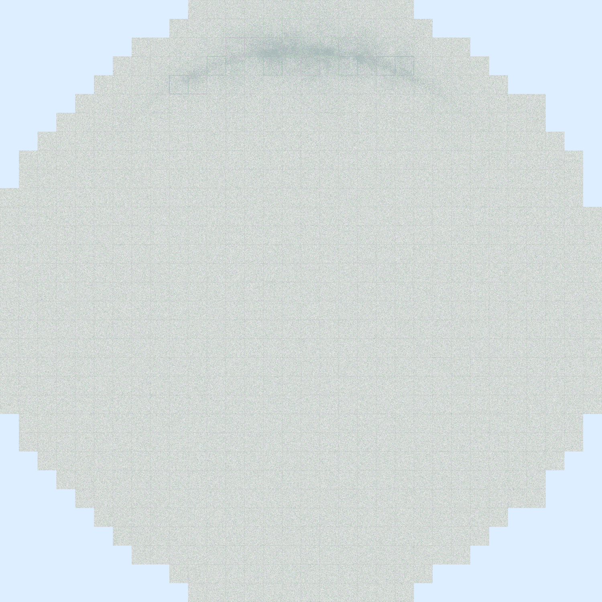
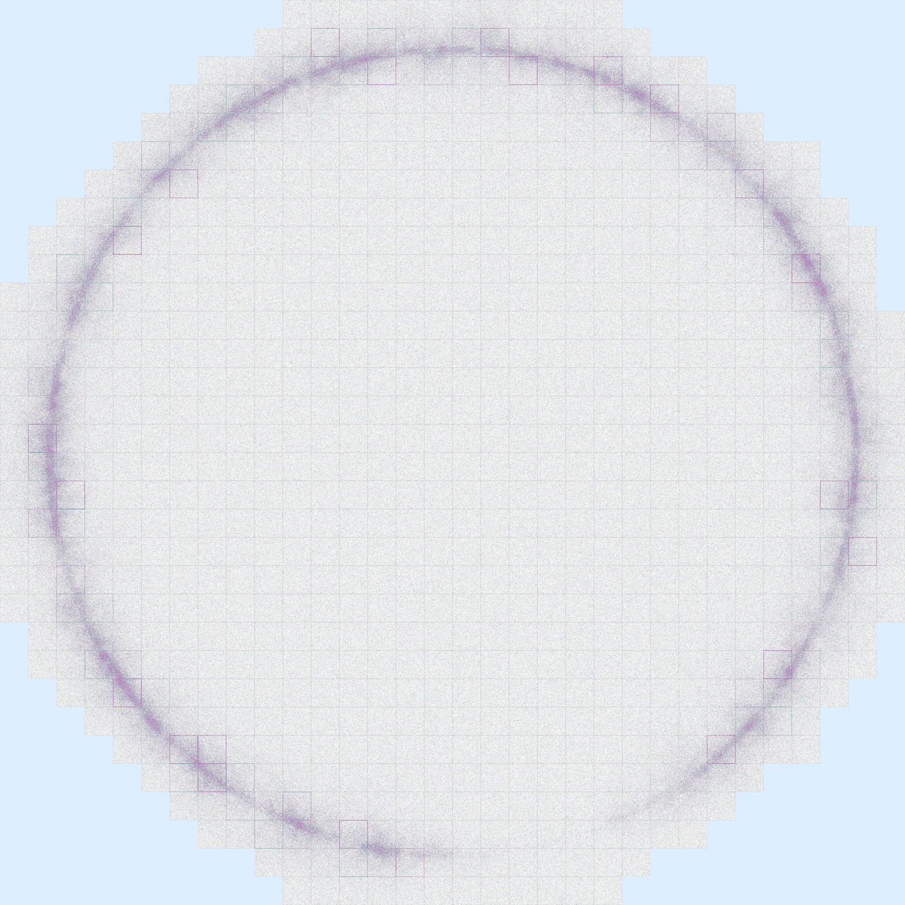
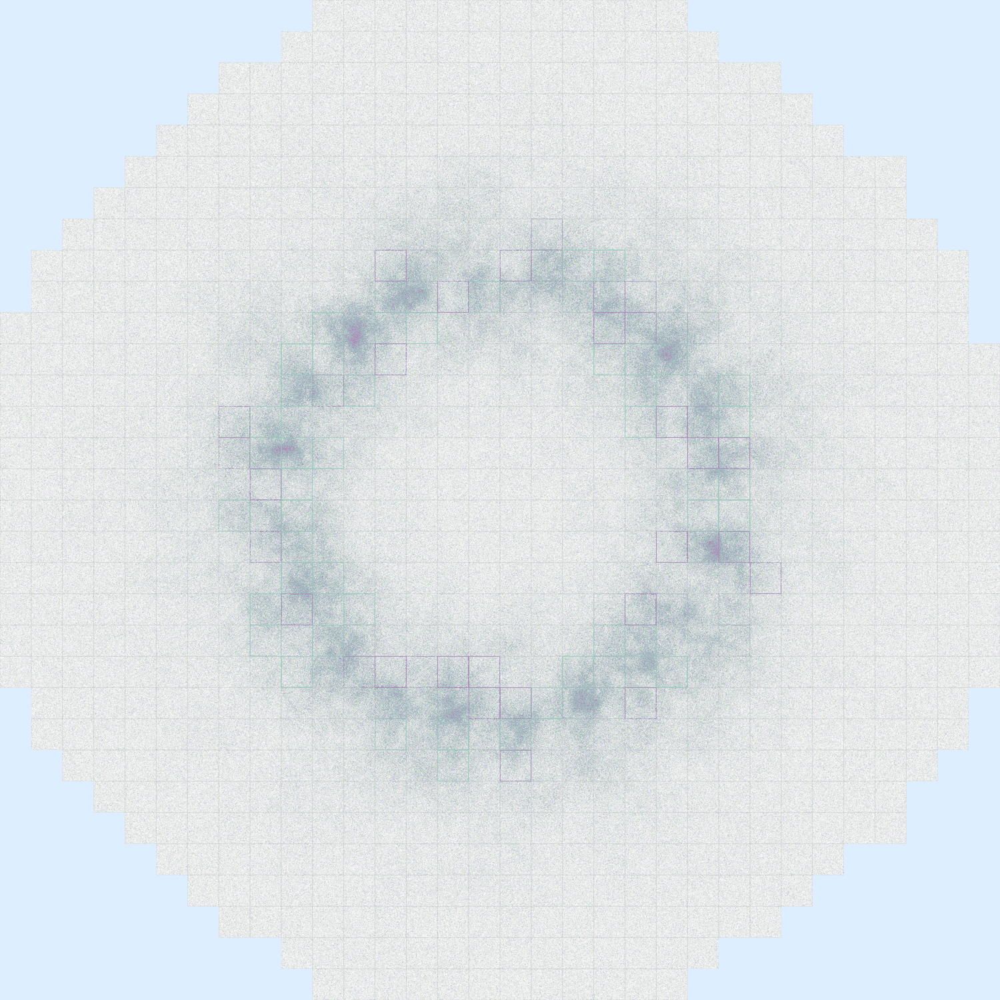
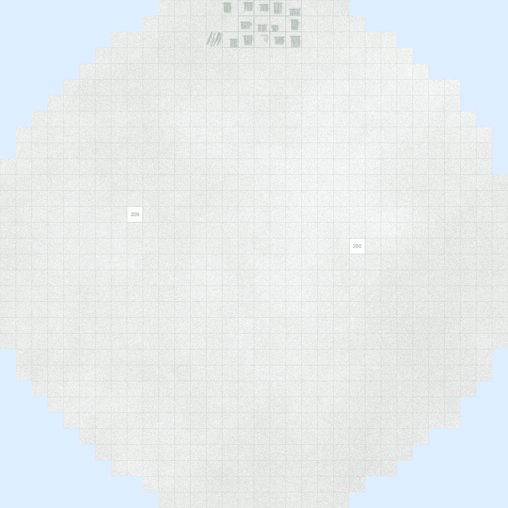
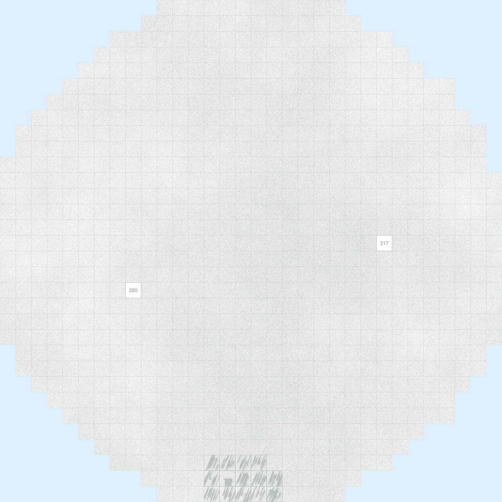
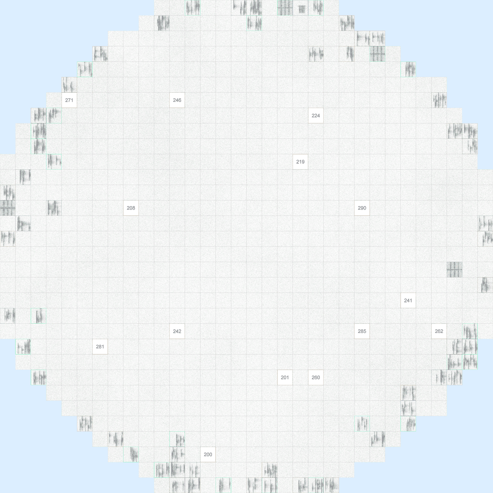
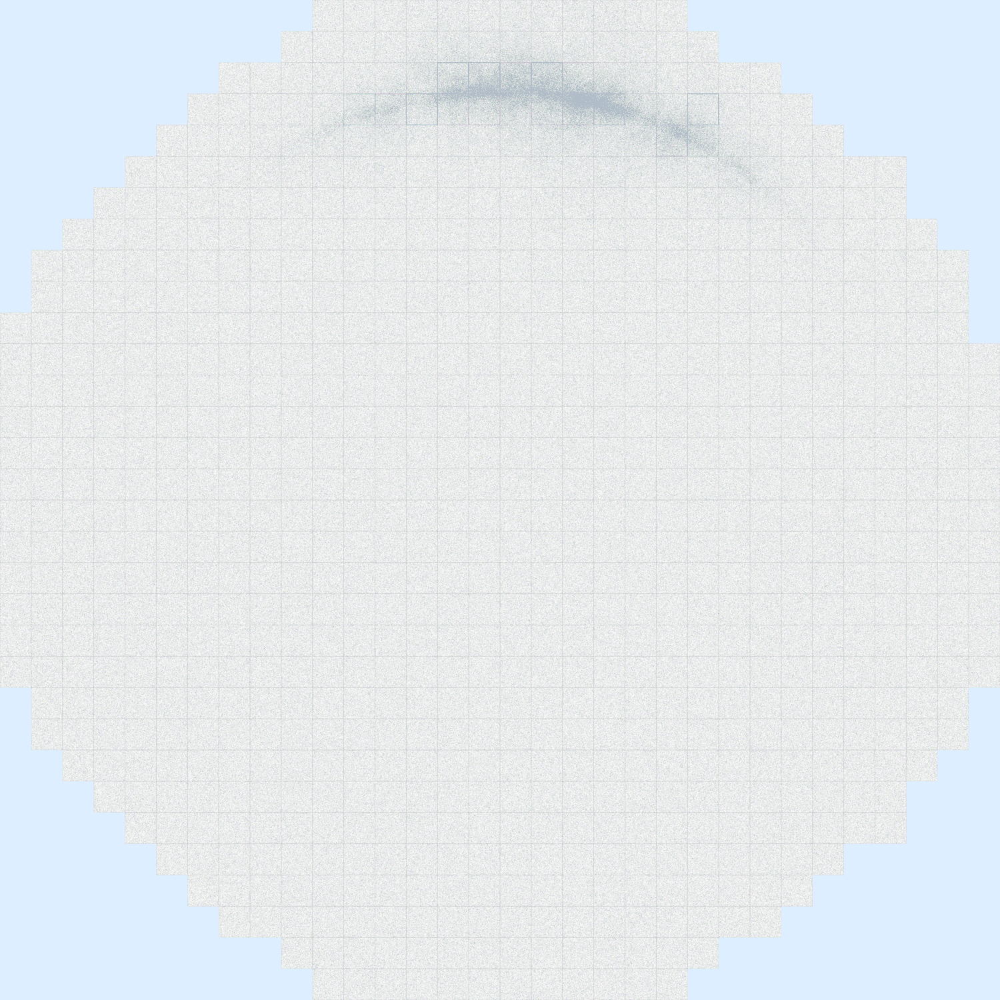
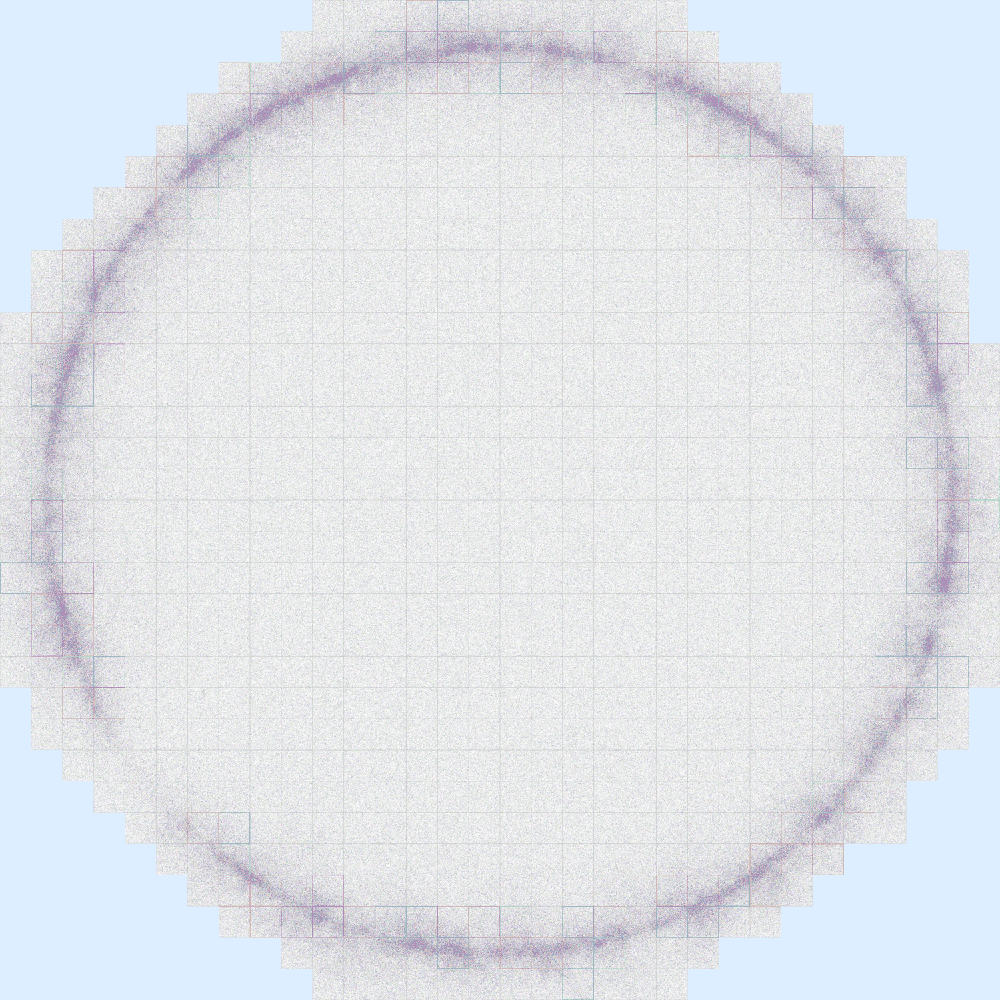
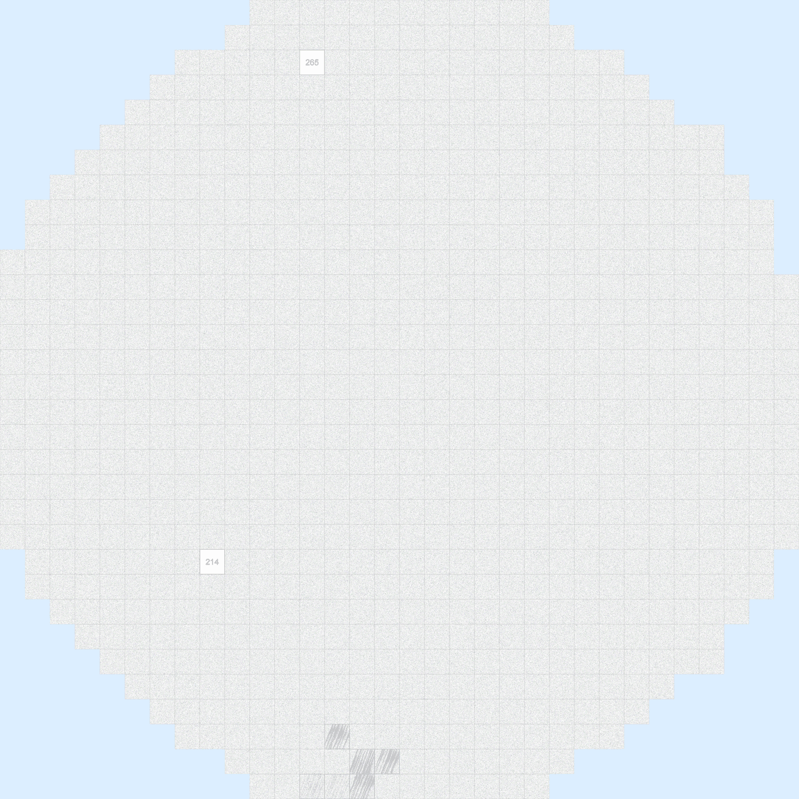
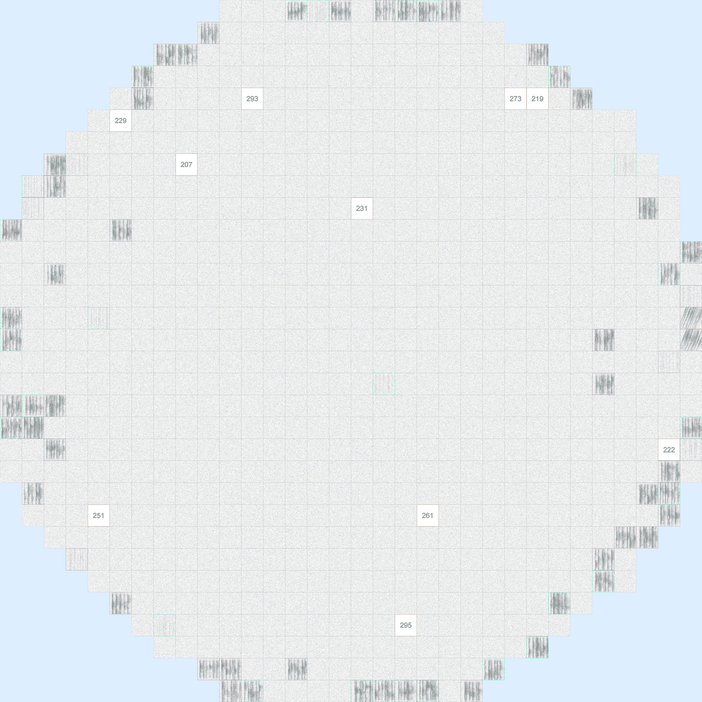

# Contrastive Wafer Defect Clustering

## 프로젝트

WM-811K wafer 결함 패턴을 **label 없이** group 으로 자동 묶는다.
- 학습 데이터 = 42 defect class 평균 30 + Normal 1000 = **2,146 wafer** (label 안 씀)
- 학습 후 embedding → HDBSCAN → group 자동 발견
- 평가는 학습 끝난 뒤 GT 라벨로 group 품질만 채점

## 기본 골격

```
wafer ──► CNN ──► 128-dim emb ──► HDBSCAN ──► group A, B, ..., N + noise
        (frozen)   (학습 대상)               (mcs=12, eps=0.06)
```

학습 = 같은 wafer 두 augment view 만 positive, 다른 wafer 는 negative (InfoNCE).

---

## 주요 지표 + 주요 실험

### 운영 통과 4 기준 (lock-in)

| 우선순위 | 지표 | 기준 | 운영 의미 |
|---|---|---|---|
| **P1** | class_capture_rate | = 1.000 | 결함 종류 한 개라도 누락 X |
| **P2** | noise(def) | ≤ 6% | 결함 wafer 분류 누락 비율 |
| **P3** | Completeness | ≥ 0.9 | 같은 class 가 한 group 으로 |
| **P4** | Homogeneity | ≥ 0.9 | 한 group 안에 한 class 만 |

보조: AMI / ARI / Silhouette.

### Two-King — 30 iter ablation 결과

| metric | **Iter 1 (P2 King)** | **Iter 14 (Quality King)** |
|---|---:|---:|
| **noise(def) P2** | **4.62% ★** | 6.63% |
| **Comp P3** | 0.948 | **0.952 ★** |
| **capture P1** | 1.000 ✅ | 1.000 ✅ |
| **Hom P4** | 0.898 | **0.908 ★** |
| AMI | 0.904 | **0.913 ★** |
| ARI | 0.733 | **0.763 ★** |
| Silhouette | 0.777 | 0.725 |

cfg 차이 4 axis: `LR_HEAD 1e-3↔5e-4`, `NEG_SIM 0.72↔0.65`, `NCE_TEMP 0.07↔0.05`, 나머지 동일.

### 주요 실험 (전체 30 iter 중 의미 있는 8개)

| # | atomic 변경 | Comp | AMI | noise(def) | capture | ARI | 판정 |
|---|---|---:|---:|---:|---:|---:|---|
| **A0** | baseline | 0.938 | 0.895 | 9.34% | 1.000 | 0.704 | base |
| **1 ★** | LW 0.5→1.0 | 0.948 | 0.904 | **4.62%** | 1.000 | 0.733 | **P2 King** |
| 6 | EPOCHS 5→10 | 0.798 | 0.806 | 9.34% | 1.000 | 0.557 | reject (over-fit) |
| 9 | PercPos α=0.85 | 0.813 | 0.826 | 5.15% | 1.000 | 0.601 | reject (PercPos dead) |
| **11** | LR 1e-3→5e-4 | 0.948 | 0.905 | 6.11% | 1.000 | 0.734 | accept |
| **13** | + NEG 0.72→0.65 | 0.949 | 0.906 | 5.32% | 1.000 | 0.743 | accept |
| **14 ★★** | + TEMP 0.07→0.05 | **0.952** | **0.913** | 6.63% | 1.000 | **0.763** | **Quality King** |
| 17 | WARMUP 1→2 | 0.944 | 0.890 | 7.94% | **0.976 ❌** | 0.698 | reject (P1 violation) |

기타 22 iter 는 LW 사촌 / TEMP 사촌 / LR 사촌 / TOPK / QUEUE / BATCH / multi-axis combo — 모두 reject 또는 == Iter 1/14. 자세한 묶음은 `docs/paper/ITERATIONS.md`.

진짜 lever 4 axis: **LW**, **LR_HEAD**, **NEG_SIM**, **NCE_TEMP**. 나머지 axis 모두 dead.

---

## 1. 데이터 sample — 이런 wafer 들로 학습

학습 단계엔 GT label 안 씀. wafer 1 장당 augment 두 view 뽑아 self-paired contrastive.

<table>
<tr>
<td align="center"><br><b>CrescentArc</b><br>canvas (호형 패턴)</td>
<td align="center"><br><b>BrokenRing</b><br>canvas (끊어진 ring)</td>
<td align="center"><br><b>RingDots</b><br>canvas (점 분포 ring)</td>
</tr>
<tr>
<td align="center"><br><b>Edge-Top_fork</b><br>site=Edge-Top, chip=fork</td>
<td align="center"><br><b>Edge-Bottom_scratch_rot</b><br>site=Edge-Bottom, chip=scratch_rot (-21°)</td>
<td align="center"><br><b>Edge-Ring_scratch</b><br>site=Edge-Ring, chip=scratch</td>
</tr>
</table>

다양성: **canvas 외형만** 3 종 (CrescentArc / BrokenRing / RingDots) + **site×chip-defect** 3 종 (Edge-Top fork / Edge-Bottom scratch_rot / Edge-Ring scratch). 학습 anchor 는 이런 종류 42 class × 평균 30 + Normal 1000 = 2,146 wafer.

## 2. grouping 결과 — 여러 wafer → 한 group

학습 후 embedding → HDBSCAN. 각 panel 은 **같은 group 안의 9 wafer** (medoid 1 + 가까운 8). 4 group sample (Iter 14 결과):

<table>
<tr>
<td align="center"><br><b>group #10 — CrescentArc</b><br>43 wafer 한 group (canvas 같은 호형)</td>
<td align="center"><br><b>group #9 — BrokenRing</b><br>17 wafer 한 group (canvas)</td>
</tr>
<tr>
<td align="center"><br><b>group #36 — Edge-Bottom_scratch_rot</b><br>13 wafer 한 group (chip object)</td>
<td align="center"><br><b>group #25 — Edge-Ring_scratch</b><br>20 wafer 한 group (chip object)</td>
</tr>
</table>

→ section 1 의 single wafer 가 section 2 처럼 **같은 외형/위치/결함끼리 자동으로 묶인다**. label 없이.

→ 모델이 **site × chip-object × wafer-canvas** 3 축 모두 인식.

---

## GROUP 어떻게 만드나

```
[1] 학습 단계 (label 안 씀)
─────────────────────────────────
wafer 1 장
   │
   ├──► augment view 1 (random crop, rotate, flip)
   │       │
   │       └──► CNN backbone (ConvNeXtV2-base, frozen)
   │              │
   │              └──► projection head (학습 대상, 128-dim)
   │                     │
   │                     └──► z₁ (128-dim)
   │
   └──► augment view 2 (다른 random)
           └──► (위와 같은 CNN+head)
                 └──► z₂ (128-dim)

학습 목표:
  · 같은 wafer 의 z₁ ↔ z₂ → cosine sim ↑ (positive pair)
  · 다른 wafer 의 z   → cosine sim ↓ (negative, queue 4096 + batch 8)

Loss = InfoNCE = -log[ exp(sim(z₁,z₂)/τ) / Σ exp(sim(z₁,z_neg)/τ) ]


[2] embedding 추출 (학습 끝난 후)
─────────────────────────────────
2,146 wafer × 1 image (augment 안 함)
   │
   └──► CNN+head → 2,146 × 128-dim embedding matrix


[3] HDBSCAN 으로 group 자동 발견
─────────────────────────────────
embedding 2,146 점
   │
   └──► HDBSCAN(min_cluster_size=12, min_samples=4,
                cluster_selection_method='leaf',
                cluster_selection_epsilon=0.06,
                metric='euclidean')
          │
          ├──► group #0 (size N₀ ≥ 12)
          ├──► group #1 (size N₁ ≥ 12)
          ├──► ...
          ├──► group #43 (size N₄₃ ≥ 12)
          └──► noise (= group 못 들어간 wafer)
```

**핵심**: 학습 단계에 GT label 안 씀. HDBSCAN 도 label 안 씀. group 개수 ('n_clusters') 도 모델이 자동으로 정함 (mcs=12 가 유일한 size 제약). 평가만 GT 사용.

---

## 학습 기법

### 1. InfoNCE — 자기-자기 끌어당기고 남-남 밀어내기

label 없이 모델 학습 시키는 핵심 loss.

```
positive: 같은 wafer 두 augment view (z_a, z_b)
negative: 다른 wafer 4104 개 (queue 4096 + batch 8)

L = -log [ exp(sim(z_a, z_b) / τ) / Σ_neg exp(sim(z_a, z_neg) / τ) ]
                                  ↑ τ = 0.05 ~ 0.07 (sharp ↔ smooth)
```

### 2. USE_LOCAL — grid spatial contrast

wafer 한 장을 6×6 grid 로 잘라 grid 간 patch contrast → wafer 위치 정보 (Edge-Top vs Edge-Bottom) 보존.
- LOCAL_WEIGHT 0.5 → 1.0 변경이 Iter 1 의 noise 9.34 → 4.62% 만든 핵심 lever.

### 3. USE_QUEUE (MoCo) — momentum bank 4096

batch 8 만으로는 negative 부족 → queue 4096 으로 누적.

### 4. Hard Negative — IGNORE_NEG_SIM

```
cos_sim(anchor, neg) ≥ 0.72 (또는 0.65)  →  skip (false negative 의심)
```

너무 비슷한 negative = 같은 class 인데 다른 wafer 일 가능성 → 빼서 sister-class 분리 ↑.

### 5. NCE_TEMP — softmax sharpness

τ 작을수록 (0.05) hardest negative 만 강하게 밀음. Iter 14 의 Quality King lever.

### 거부한 옵션

- **SupCon (Khosla 2020)** ❌ unknown defect generalization 위험
- **Multi-crop (SwAV)** ❌ wafer 위치 정보 손상
- **NV-Retriever PercPos** ❌ α 4-step sweep 모두 dead

---

## 평가 지표 — 시각화 + 예시

각 wafer 는 **학습 안 본** GT class 라벨이 붙어 있다 (`Center_scratch`, ... 42종 + `Normal`). HDBSCAN group 이 GT 와 얼마나 일치하는지 채점.

```
N = 2,146 wafer
y_i = wafer i 의 GT class                       (학습엔 안 씀)
c_i = wafer i 의 HDBSCAN group (또는 noise=-1)  (자동 발견)
defect_only = Normal 제외 1,146 wafer
```

### P3 — Completeness (Rosenberg & Hirschberg 2007)

같은 GT class 가 **한 group 에 모여 있는가**.

```
Completeness = 1 − H(C | Y) / H(C)
```

`Center_scratch` GT 30 wafer 가 어디 들어갔나 (각 ● = wafer 1):

```
case ① Comp ≈ 1.00 ★ (모두 한 group)        case ② Comp ≈ 0.7 (두 group split)
─────────────────────────                   ─────────────────────────────
group #21:  ●●●●●●●●●●●●●●●●●●●●●●●●●●●●●●  group #21:  ●●●●●●●●●●●●●●●     ← 15
                                            group #22:  ●●●●●●●●●●●●●●●     ← 15

case ③ Comp ≈ 0.4 (5 group 잘게 흩어짐)     case ④ Comp 무의미 (전부 noise)
─────────────────────────                   ─────────────────────────
group #21:  ●●●●●●        ← 6                group #21:  비어 있음
group #22:  ●●●●●●●       ← 7                noise:      ●●●●●●●●●●●●●●●●●●●●●●●●●●●●●●
group #23:  ●●●●●         ← 5                            ↑ 30 wafer 다 noise (label = -1)
group #24:  ●●●●●●        ← 6
group #25:  ●●●●●●        ← 6                ※ sklearn: noise(-1) 도 한 label 로 보니
                                                Comp 자체는 trivially ≈ 1.0 이 나옴.
                                                하지만 P1 capture = 0 ❌, P2 noise = 100% ❌
                                                로 다른 지표가 잡음. AMI 도 chance correction
                                                으로 0 에 가까워짐.
```

**기준: ≥ 0.9** (현재 0.948 ~ 0.952).

### P1 — class_capture_rate

42 defect class 중 **group 으로 한 번이라도 잡힌 비율**.

```
captured(c) = 1 if class c 의 wafer ≥ 1 개가 noise 가 아닌 group 에 들어감 else 0
class_capture_rate = mean(captured)
```

```
case ① 1.000 ✅ (운영 통과)               case ② 0.976 ❌ (P1 violation)
─────────────────                        ─────────────────
Center_scratch        ✓ (group #21)      Center_scratch        ✓ (group #21)
Center_fork           ✓ (group #14)      Center_fork           ✓ (group #14)
... (40 class 더)     ✓                  ... (40 class 더)     ✓
Donut_scratch_rot     ✓ (group #38)      Donut_scratch_rot     ✗ (15/15 noise)  ← 통째 누락
                      42/42 = 1.000                            41/42 = 0.976
                                                               (이 결함 종류 한 번도 못 알아챔)
```

**기준: 1.000.** 0.976 도 ❌. 운영 통과의 첫 관문 (recall 느낌).

### P2 — noise(def) (defect only)

defect 1,146 wafer 중 group 못 들어간 비율. 50 dot 로 정규화 (1 dot = 약 23 wafer):

```
case ① 4.62% ★ (Iter 1)
●●●●●●●●●●●●●●●●●●●●●●●●●●●●●●●●●●●●●●●●●●●●●●●●○○      group ● 48, noise ○ 2
↑ 1,093 group / 53 noise  →  95.4% group 통과

case ② 6.63% (Iter 14)
●●●●●●●●●●●●●●●●●●●●●●●●●●●●●●●●●●●●●●●●●●●●●●●○○○      group ● 47, noise ○ 3
↑ 1,070 group / 76 noise  →  93.4% group 통과

case ③ 85% (학습 실패 sample)
●●●●●●●○○○○○○○○○○○○○○○○○○○○○○○○○○○○○○○○○○○○○○○○○○      group ● 7, noise ○ 43
↑ 169 group / 977 noise  →  거의 다 noise (Iter 6 EPOCHS=10 over-fit)
```

**의미**: noise = "이게 뭔 결함인지" 모르고 분류 도구가 "기타" 처리. 기준: ≤ 6% ideal, ≤ 10% 허용, > 30% = 학습 실패.

### P4 — Homogeneity (Comp 의 dual)

각 group 안에 **한 GT class 만**.

```
case ① Hom = 1.00 ★ (pure)              case ② Hom ≈ 0.7 (sister mixed)
─────────────────────                    ───────────────────────
group #21:                               group #21:
  Center_scratch  ●●●●●●●●●●               Center_scratch  ●●●●●●●●●●
  Center_scratch  ●●●●●●●●●●               Center_scratch  ●●●●●●●●●●
  Center_scratch  ●●●●●●●●●●               Donut_scratch   ●●●●●●●●●●  ← sister 섞임

case ③ Hom ≈ 0.4 (mega-cluster, 운영 X)
─────────────────────────────
group #15:  Center_scratch / Edge-Top_scratch / Donut_scratch / ...   ← 6 class 한 group
            (purity 0.34, 의미 무너짐)
```

**기준: ≥ 0.9.** Comp 와 trade-off — group 잘게 나누면 Hom↑ Comp↓. AMI 가 둘 동시 봄.

### AMI (Adjusted Mutual Information)

Comp + Hom 한꺼번에 + **chance correction**.

```
GT  :   A  A  A   B  B  B
case ①: 1  1  1   2  2  2     완벽 일치           AMI ≈ 1.00 ★
case ②: 1  1  2   1  2  2     반쯤 섞임           AMI ≈ 0.20
case ③: 1  2  3   1  2  3     random group       AMI ≈ 0.00
case ④: 1  1  1   1  1  1     trivial 한 묶음     AMI ≈ 0.00 (Comp 가 1 인데도)
```

→ NMI 와 다른 점: case ④ trivial 묶기를 chance 로 보고 0 으로 깎음.

### ARI (Adjusted Rand Index)

wafer **pair 단위 일치율** + chance correction.

```
4 wafer (pair 6 개) — GT [A, A, B, B]:

case ① 모델 [1, 1, 2, 2] (완벽)        case ② 모델 [1, 2, 2, 1] (거꾸로)
pair (1,2): GT 같음+group 같음 = a✓    pair (1,2): GT 같음+group 다름 = d
pair (1,3): GT 다름+group 다름 = b✓    pair (1,3): GT 다름+group 같음 = c
pair (1,4): GT 다름+group 다름 = b✓    pair (1,4): GT 다름+group 같음 = c
pair (2,3): GT 다름+group 다름 = b✓    pair (2,3): GT 다름+group 같음 = c
pair (2,4): GT 다름+group 다름 = b✓    pair (2,4): GT 다름+group 같음 = c
pair (3,4): GT 같음+group 같음 = a✓    pair (3,4): GT 같음+group 다름 = d

a=2, b=4 → ARI = 1.00 ★                a=0, b=0, c=4, d=2 → ARI = -0.5 (random 보다 나쁨)
```

### Silhouette (cosine, GT 안 봄)

embedding 자체 모양만 채점.

```
s_i = (b_i − a_i) / max(a_i, b_i)   ∈ [-1, 1]
  a_i = 자기 group 내 평균 cosine 거리
  b_i = 가장 가까운 다른 group 의 평균 거리

s ≈ +0.8 (good)              s ≈ +0.1 (애매)            s ≈ -0.5 (bad)
●●●●                          ●●●●                       ●●●●
●●●●     ●●●●                ●●●●●●●●                   ●●●●  ●  ●
●●●●     ●●●●                  ●●●●  ●●●●                  ●  ●●●●

자기 group 빽빽,             자기 group 안 퍼짐,         자기 group 보다 다른
다른 group 멀리              다른 group 거의 붙음        group 이 더 가까움
```

(현재 운영 0.72 ~ 0.78)

---

## paper grounding

- **Contrastive SSL**: SimCLR (Chen 2020), MoCo v2 (He 2020), InfoNCE (Oord 2018)
- **Local contrast**: DenseCL (Wang 2021)
- **HDBSCAN**: Campello 2013, McInnes 2017
- **Tier 1 metrics**: Completeness/Homogeneity (Rosenberg & Hirschberg 2007), AMI (Vinh 2010), ARI (Hubert & Arabie 1985), Silhouette (Rousseeuw 1987)
- **Backbone**: ConvNeXtV2 FCMAE (Woo 2023) → sister repo `known-cnn` 의 supervised CNN TAPT → frozen
